机器学习基石Lec1-Lec4主要知识点：对应作业1
<!-- more -->

## 关于机器学习

### 定义及特点

基本定义：

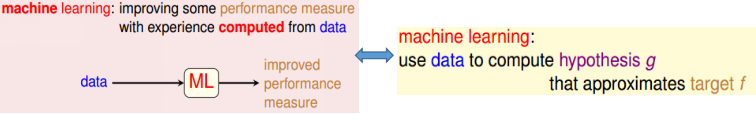

判别问题是否适合采用机器学习的准则：

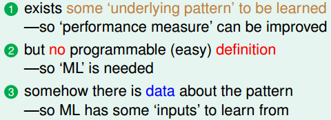

### 基本框架

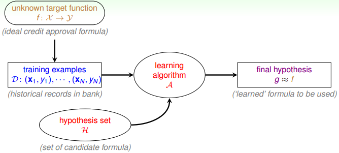

## 0/1判别问题

### 感知机算法

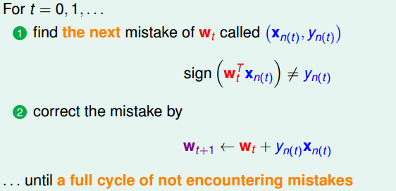

- 优点：实现简便，运行速度快
- 缺点：只能针对线性可分的数据集

### 感知机可行性分析

① $w_t$随着迭代次数$t$的增加而逐渐向$w_f$“靠拢”

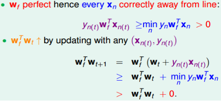

后续推导用到的公式$w_f^Tw_{t+1}\ge w_f^Tw_t+min_ny_nw_f^Tx_n$（1）

② $w_t$的“靠拢”是逐渐的

后续推导用到的公式$||w_{t+1}||^2\leq ||w_t||^2+max_n||x_n||^2$（2）

③ 证明迭代次数有限：

由(1)可知：$w_f^Tw_{T}\ge w_f^Tw_{T-1}+min_ny_nw_f^Tx_n\ge...\ge w_f^Tw_{0}+T\cdot min_ny_nw_f^Tx_n$

由(2)可知：$||w_{T}||^2\leq ||w_{T-1}||^2+max_n||x_n||^2\le...\leq ||w_{0}||^2+T\cdot max_n||x_n||^2\to ||w_T||\le\sqrt{T}max_n||x_n||$

从而可以得到下式：
$$
\frac{w_f^Tw_T}{||w_f||\cdot||w_T||}\ge\frac{w_f^Tw_{0}+T\cdot min_ny_nw_f^Tx_n}{||w_f||\cdot||w_T||}\ge\frac{w_f^Tw_{0}+T\cdot min_ny_nw_f^Tx_n}{||w_f||\cdot\sqrt{T}max_n||x_n||}
$$
当$w_0=0$时：
$$
\frac{w_f^Tw_T}{||w_f||\cdot||w_T||}\ge\frac{T\cdot min_ny_nw_f^Tx_n}{||w_f||\cdot\sqrt{T}max_n||x_n||}\to T\le \frac{R^2}{\rho^2}
$$
其中$R^2=max_n||x_n||^2,\ \rho=min_ny_n\frac{w_f^T}{||w_f||}x_n$

因此得证。（其中利用到上式的左边$\leq1$）

### Pocket算法

为了解决线性不可分问题而引入（更准确而言是针对带有杂讯的“原本”线性可分数据）：

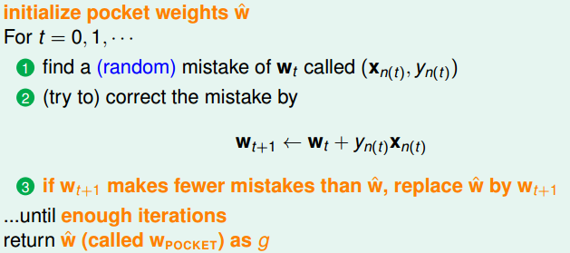

缺点：效率相比PLA要慢很多（主要在于每次迭代后都要计算错误率）

## 不同种类的学习

### 根据输出空间$\mathcal{Y}$不同进行划分

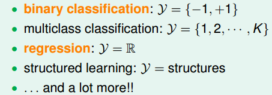

### 根据数据标签$y_n$不同进行划分

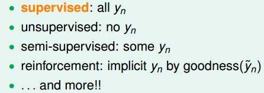

### 根据学习原型$f\Rightarrow(\mathbb{x_n},y_n)$不同进行划分

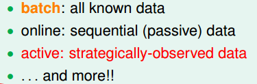

### 根据输入空间$\mathcal{X}$不同进行划分

## 学习可行性分析

### 引入小球容器模型

利用样本概率分布近似整体概率分布：

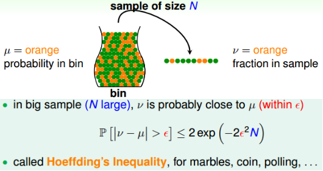

关于Hoeffding不等式的详细内容可见[Hoeffding's Inequality](https://www.wikiwand.com/en/Hoeffding's_inequality)

### 从容器模型到学习模型

① 容器模型$\to$学习模型

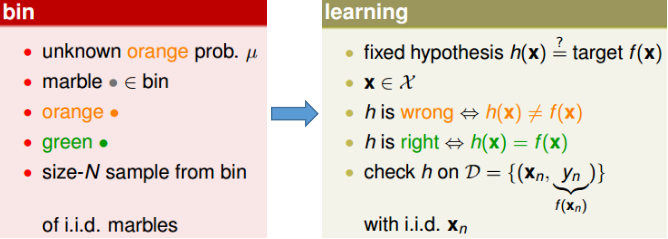

② Hoeffding不等式在学习模型中的形式

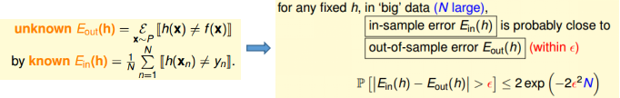

学习到的模型是否可行主要判据：①$E_{in}(h)$是否足够小  ②$E_{in}(h)\approx E_{out}(h)$是否成立

### 单个假设函数$\to$多个假设函数

通过单个假设函数情况可以发现，在$N$较大时，$E_{in}(h)\approx E_{out}(h)$的概率就比较大。但是由于可供挑选的假设函数太少(只有一个)，因此几乎很难保证$E_{in}(h)$足够小。

坏的数据集定义：数据集$D$使得$E_{in}(h)$和$E_{out}(h)$相差甚远，由Hoeffding不等式可知，对于单个假设函数而言，样本为坏的数据集的概率较小。

那么对于一系列假设函数而言，拥有的数据集(样本)是坏的数据集的概率由下式表示：

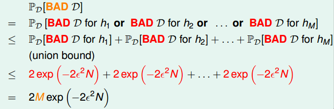

从而不难知，当我们拥有很多假设函数时，则样本为坏的数据集的概率很大！关于如何“克服”这方面问题见Lec5-Lec8