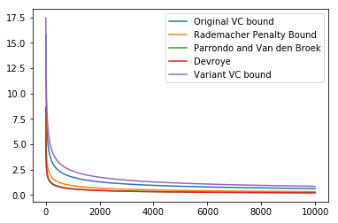
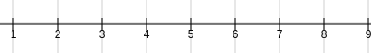
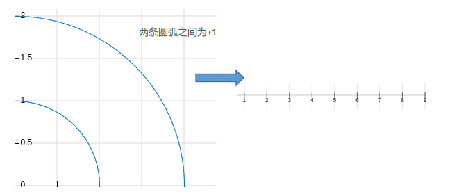
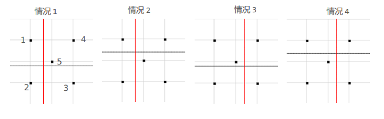
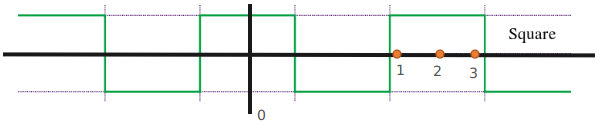
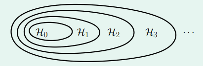

机器学习基石课后作业2-1：对应题目1～题目15
<!-- more -->

## 机器学习基石作业2

### 问题1

Q1~Q2：考虑目标中存在噪声的情况。
假设存在一个似然函数$h$能够近似一个确定的目标函数$f$，且输出错误（即$h(x)\neq f(x)$）的概率为$\mu$（注：$h$和$f$的输出均为$\{-1,+1\}$，如果我们用这个$h$去近似一个含噪声的$f$（用$y$表示），如下所示：
$$
P(x,y)=P(x)P(y|x) \\ P(y|x)=\begin{cases}\lambda, \ \ \ \ \ \ \ \ \ \  y=f(x)\\1-\lambda, \ \ \ \ otherwise\end{cases}
$$
Q1：用$h$近似带噪声的目标$y$的错误率时多少？

A1：$h$和$y$通过$f$联系在一起，因此错误的情况分为两种：①$h=f, \ f\neq y$，这种的概率$P1=(1-\mu)(1-\lambda)$ ② $h\neq f,\ f=y$，这种的概率$P2=\mu \lambda$，所以最终的错误率$P=(1-\mu)(1-\lambda)+\mu\lambda$

Q2：当$\lambda$取何值时，似然函数$h$与$\mu$无关？

A2：对Q1中的结果进行化简：$P=(2\lambda-1)\mu-\lambda+1$，因此当$\lambda=1/2$时，上式与$\mu$无关。从中也可以看出，如果噪声强大到使得$f$的结果被搞得乱七八糟的，那么似然函数取什么将“没那么重要”。因此，噪声的多少和强度在分析问题时是重要的。

### 问题2

Q3~Q5：根据一些数值情况，来加深对泛化误差的理解
主要涉及到的是VC Bound这条式子（具体的推导可见课件和教材）：
$$
\mathbb{P}_D[|E_{in}(g)-E_{out}(g)|\gt\epsilon]\le 4(2N)^{d_{vc}}exp(-\frac{1}{8}\epsilon^2N)
$$
上式中$m_H(2N)=(2N)^{d_{vc}}$，且常将$\delta=4(2N)^{d_{vc}}exp(-\frac{1}{8}\epsilon^2N)$
为了简单起见，直接令$m_H(N)=N^{d_{vc}}$，且假设$N\ge 2，d_{vc}\ge2$

Q3：对于一个$d_{vc}=10$的似然函数集$H$，如果我们希望其泛化误差$\epsilon\le0.05$的概率大于$95\%$，则下述哪个数据量与该条件最接近？
a. 500,000	b. 480,000	c. 420,000	d. 440,000	d. 460,000

A3：在计算时做一步处理，将$(2N)^{d_{vc}}exp(-\frac{1}{8}\epsilon^2N)=exp(d_{vc}\cdot log(2N)-\frac{1}{8}\epsilon^2N)$，再将不同数据代入即可，最后可以发现$N=460,000$是最接近的。

Q4&Q5：除了VC Bound之外，还有许多其他的Bounds准则，主要有以下5种：
a. Original VC bound：$\epsilon\le\sqrt{\frac{8}{N}ln\frac{4m_H(2N)}{\delta}}$
b. Rademacher Penalty Bound：$\epsilon\le\sqrt{\frac{2}{N}ln(2Nm_H(N))}+\sqrt{\frac{2}{N}ln\frac{1}{\delta}}+\frac{1}{N}$
c. Parrondo and Van den Broek：$\epsilon\le\sqrt{\frac{1}{N}(2\epsilon+ln\frac{6m_H(2N)}{\delta})}$
d. Devroye：$\epsilon\le\sqrt{\frac{1}{2N}(4\epsilon(1+\epsilon)+ln\frac{4m_H(N^2)}{\delta})}$
e. Variant VC bound：$\epsilon\le\sqrt{\frac{16}{N}ln\frac{2m_H(N)}{\sqrt\delta}}$
假设$d_{vc}=50,\ \delta=0.05$，则对于不同$N$(10,000和5)的情况下，各Bounds中哪个值最小？

A4&A5：可以通过程序来实现

```python
n = np.arange(3, 10000)
f1 = np.sqrt(8/n*(np.log(80)+50*np.log(2*n)))
print('Original VC bound (10000) and (5): ', f1[-1], '\t', f1[2])
f2 = np.sqrt(2/n*(np.log(2*n)+50*np.log(n)))+np.sqrt(2/n*math.log(20))+1/n
print('Rademacher Penalty Bound (10000) and (5): ', f2[-1], '\t', f2[2])
f3 = 1/n+np.sqrt(1/np.power(n, 2)+1/n*(np.log(120)+50*np.log(2*n)))
print('Parrondo and Van den Broek (10000) and (5): ', f3[-1], '\t', f3[2])
f4 = 1/(n-2)+np.sqrt(1/np.power(n-2, 2)+1/(2*n-4)*(np.log(80)+100*np.log(n)))
print('Devroye (10000) and (5): ', f4[-1], '\t', f4[2])
f5 = np.sqrt(16/n*(np.log(2/math.sqrt(0.05))+50*np.log(n)))
print('Variant VC bound (10000) and (5): ', f5[-1], '\t', f5[2])
plt.plot(n, f1, label='Original VC bound')
plt.plot(n, f2, label='Rademacher Penalty Bound')
plt.plot(n, f3, label='Parrondo and Van den Broek')
plt.plot(n, f4, label='Devroye')
plt.plot(n, f5, label='Variant VC bound')
plt.legend()
plt.show()
```

    Original VC bound (10000) and (5):  0.632203362312 	 13.828161485
    Rademacher Penalty Bound (10000) and (5):  0.33132369478 	 7.04877656418
    Parrondo and Van den Broek (10000) and (5):  0.223708366246 	 5.10136198199
    Devroye (10000) and (5):  0.215237656725 	 5.59312554318
    Variant VC bound (10000) and (5):  0.860464345894 	 16.264111061



因此对于$N=10,000$的情况Devroye最小，对于$N=5$的情况parrondo最小

### 问题3

Q6~Q11：主要考察growth function和VC维的问题

Q6&Q7：求“positive-and-negative intervals on R”这种类型似然函数集：①在区间$[l, r]$之间为$+1$，其他地方为$-1$或者②在区间$[l, r]$之间为$-1$，其他为$+1$的growth function（$m_H(N)$）和VC维？



A6&A7：上述问题可以看成N个数据(如上图9个数据，1代表第一个数据)，则之间有N-1个空隙，扩展左边空隙变为N个空隙，则任选两个空隙$C_N^2$，则有$2C_N^2$种分法。但这样还少了全+1和全-1的情况，所以，总共应该有$N(N-1)+2=N^2-N+2$种，而VC维则直接从$N-1,2,3...$不断代入，直到其$\lt 2^N$停止。不难求得$d_{vc}=3$

Q8：二维空间上，“甜甜圈”类型的似然函数集(如下图所示)，在甜甜圈内部为+1（$a^2\le x_1^2+x_2^2\leq b^2$），外部为-1，假设$0<a<b<\inf$，求其growth function？



A8：可以将其转换为1维情况来看，对于r相等的所有数据点视为相同，则问题就转换为一维类似Q6中的情况(但条件变了)，似然函数集等价于$[l, r]$之间为+1，其他地方为-1。从而类似的分析可得growth function为$C_{N+1}^2+1$（分析时两边都扩展空隙，+1来自于全部数据标签为-1的情况）

Q9：考虑“多项式判别表达式”函数集在一维空间$\mathbb{R}$上的VC维为多少？（似然函数集如下）
$$
\mathcal{H}=\{h_c|h_c(x)=sign(\sum_{i=0}^Dc_ix^i)\}
$$
A9：本质上就等同于Lec7(9/26)上的d-D perceptrons，（可以令$x_i=x^i$，从而转化为高维空间上的感知机问题）由PPT上结果可知$d_{vc}=D+1$（这道题目可以反映出一个情况：n次方程最多有n个不重根，那么就可以将一维空间划分为n+1段，可以得到一个小结论，一维空间能被划分为K个子区域(每个区域均可+可-)，则对应的$d_{vc}=K$）

Q10：考虑d维空间$\mathbb{R}^d$上“简单决策树”似然函数集的VC维。似然函数集如下所示：
$$
\mathcal{H}=\{h_{t,S}|h_{t,S}(x)=2[v\in S]-1,\ where\ v_i=[x_i\gt t_i],\ S:a\ collection\ of\ vectors\ in\ \{0,1\}^d,\ t\in \mathbb{R}^d\}
$$
其中，通过d个阈值$t_i(i=1,...d)$，将数据$x$划分到集合S中的一个区域中去，从而$x$的标签可以根据其是否在某块区域确定。求该似然函数集的VC维？



A10：这个问题我们可以先从两个特例出发，①$d=1$时的情况，可以看成$S=\{0\},\{1\},\{0,1\},\{\}$，从而根据$t$的移动可以等价为双向射线的情况($S=\{0,1\}\{\}$可以视为另外两种的子情况)，则对应的$m(N)=2N$，$d_{vc}=2$。（也可直接根据Q9得到结果）②$d=2$时的情况，相当于通过两条线(一条与x轴平行，一条与y轴平行)将空间划分为四个区域，每个区域均可+可-（互相独立），且这两条直线可上下左右移动(相当于改变阈值$t_i$)，显然，对于$N=4$可以shatter，对于$N=5$可以划分为四大类：a. (4,5)一起，则共有$s1=2^4=16$  b. (3,5)一起，则共有$s2=2\times 2^2=8$(去除了(4,5)同号情况)  c. (1,5)一起，则共有$s3=4$  d. (2,5)一起，则共有$s4=2$。所以总共有$s=16+8+4+2=30\neq 2^5=32$，因此$N=5$不能被shatter（因为图中情况属于“最佳可分”情况，所以可以不检验其他情况）。从中也可以得出一个结论，如果某个点无法单独存在于子区域中，则不可能shatter。 ③$d=M$的情况，此时整个空间可以被划分为$2^M$个子区域，由上述分析易知，$N=2^M$可以被shatter，而$N=2^M+1$不能被shatter。
综上所属：该问的答案为$d_{vc}=2^d$

Q11：考虑一维空间上“三角波”似然函数集的VC维。三角波似然函数集如下所示：
$$
\mathcal{H}=\{h_\alpha|h_\alpha(x)=sign(|(\alpha x)mod\ 4-2|-1),\ \alpha\in\mathbb{R}\}
$$
其中$z\ mod\ 4\in[0,4)$代表取余数。



A11：通过简单的运算不难发现，该似然函数集相当于一个方波（如图所示），该方波有两个特点，关于y轴对称，周期可以随意缩放，这样就相当于将$\mathbb{R}$划分为无限段区域。由于周期可以为任意正实数，所以甚至可以近乎无限小。根据Q9的结论易知该情况$d_{VC}=\infty$。举个例子，如$N=3$时，缩小则3变为-1，放大则1变为-1，缩小到一定程度能够使得1,3变为-1，总之可以根据缩放达到任意我们希望的+1,-1组合。

### 问题4

Q12~Q15：主要对growth function$m_H(N)$和VC维性质和界限的考察（这些均指$\mathbb{Y}\in\{+1,-1\}$）

首先，对于$d_{vc}=K$的情况，$m_H(N)\leq B(N,K-1)=\sum_{i=0}^{K}\begin{pmatrix} N\\i \end{pmatrix}$

Q12：以下哪项是$N\ge d_{vc}\ge 2$情况下$m_H(N)$的上界？
a. $2^{d_{vc}}$	b. $\sqrt{N^{d_{vc}}}$		c. $m_H(\lfloor N/2\rfloor)$ 	d. $min_{1\le i\leq N-1}2^im_H(N-i)$

A12：增加一个数据，最多增加2倍可能（即+1,-1），从而可知$m_H(N)\leq 2m_H(N-1)\leq 2^im_H(N-i)$，所以d项为$m_H(N)$的上界。

Q13：以下哪一种growth function$m_H(N)$是不可能出现的？
a. $N^2-N+2$		b. $2^{\lfloor\sqrt{N}\rfloor}$		c. $2^N$	d. N

A13：b项显然不可能，当$N=2$和$N=3$时是相等的，但$N=4$时却不同了，显然这不可能。其中有个结论：growth function是单调递增的

Q14：有一系列似然函数集$\mathcal{H}_1,\mathcal{H}_2,...,\mathcal{H}_K$，对应的VC维为$d_{vc}(\mathcal{H}_k)$，以下哪一个选项是这一系列似然函数集的交集$d_{vc}(\cap_{k=1}^K\mathcal{H}_k)$的紧上下界限？
a. $min\{d_{vc}(\mathcal{H}_k)\}_{k=1}^K\leq d_{vc}(\cap_{k=1}^K\mathcal{H}_k)\leq max\{d_{vc}(\mathcal{H}_k)\}_{k=1}^K$
b. $0\le d_{vc}(\cap_{k=1}^K\mathcal{H}_k)\leq\sum_{k=1}^Kd_{vc}(\mathcal{H}_k)$
c. $min\{d_{vc}(\mathcal{H}_k)\}_{k=1}^K\leq d_{vc}(\cap_{k=1}^K\mathcal{H}_k)\leq \sum_{k=1}^Kd_{vc}(\mathcal{H_k})$
d. $0\le d_{vc}(\cap_{k=1}^K\mathcal{H}_k)\le min\{d_{vc}(\mathcal{H}_k)\}_{k=1}^K$
e. $0\le d_{vc}(\cap_{k=1}^K\mathcal{H}_k)\le max\{d_{vc}(\mathcal{H}_k)\}_{k=1}^K$



A14：当全部$\mathcal{H}_k$均没有交集的情况下，则为$\emptyset$，从而下界为0，当为上图这种情况时交集为$\mathcal{H}_0$，从而为$min\{d_{vc}(\mathcal{H}_k)\}_{k=1}^K$，因此答案为d

Q15：以下哪一个选项是这一系列似然函数集的并集$d_{vc}(\cup_{k=1}^K\mathcal{H}_k)$的紧上下界限？
a. $min\{d_{vc}(\mathcal{H}_k)\}_{k=1}^K\leq d_{vc}(\cup_{k=1}^K\mathcal{H}_k)\leq \sum_{k=1}^Kd_{vc}(\mathcal{H}_k)$
b. $0\le d_{vc}(\cup_{k=1}^K\mathcal{H}_k)\leq\sum_{k=1}^Kd_{vc}(\mathcal{H}_k)$
c. $max\{d_{vc}(\mathcal{H}_k)\}_{k=1}^K\leq d_{vc}(\cup_{k=1}^K\mathcal{H}_k)\leq \sum_{k=1}^Kd_{vc}(\mathcal{H_k})$
d. $0\le d_{vc}(\cup_{k=1}^K\mathcal{H}_k)\le \sum_{k=1}^Kd_{vc}(\mathcal{H_k})+K-1$
e. $max\{d_{vc}(\mathcal{H}_k)\}_{k=1}^K\le d_{vc}(\cup_{k=1}^K\mathcal{H}_k)\le\sum_{k=1}^Kd_{vc}(\mathcal{H_k})+K-1$

A15：显然并集包含最少似然函数的情况如上图所示，因此，下界为$max\{d_{vc}(\mathcal{H}_k)\}_{k=1}^K$，上界可以根据一个特例来说明：有一个$\mathcal{H}_1$，把平面所有点分为+1，$\mathcal{H}_2$把平面所有点分为-1。$\mathcal{H}_1$并$\mathcal{H}_2$的话为VC dimension为1，而各自$d_{vc}$加起来为0。