机器学习基石Lec5-Lec8主要知识点：对应作业2
<!-- more -->

## 训练vs测试

### 假设函数集数量的影响

机器学习能否可行的两个问题和假设函数集中假设函数的数量$M$的关系：

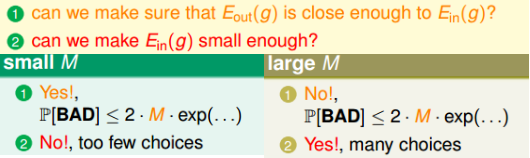

### 有效假设函数

假设函数集中往往存在很多“冗余”(类似)假设函数，可以将相近的假设函数归为一类，当做一个假设函数，从而有效减少假设函数集中假设函数数量。

- $\mathcal{H}(x_1,x_2,...,x_N)$：针对数据集$x_1,x_2,...,x_N$，$\mathcal{H}$中存在的有效假设函数集。用$|\mathcal{H}|$表示该有效假设函数集中假设函数数量
- 增长函数$m_{\mathcal{H}}(N)$定义：$m_{\mathcal{H}}(N)=max_{x_1,x_2,...,x_N\in \mathcal{X}}|\mathcal{H}(x_1,x_2,...,x_N)|$
- shatter的定义(此处只针对二元分类问题)：如果$m_{\mathcal{H}}(N)=2^N$，则称这N个输入能够被shatter
- 断点的定义：如果k个输入不能被假设函数集shatter，则称k为断点

从而可以将假设函数集对应的Hoeffding不等式表示为：

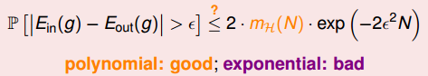

如果我们能够获得$m_{\mathcal{H}}(N)=poly(N)$则当$N$足够大时能够有效

## 泛化理论

### 断点带来的约束

边界函数$B(N,k)$的定义：当断点为$k$时，对应的$m_{\mathcal{H}}(N)$的最大可能数目

由于存在断点，使得$m_{\mathcal{H}}(N)$随着$N$增大时，并不会急速增大：

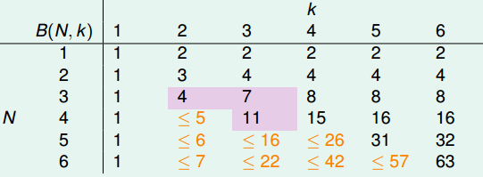

### 边界函数推导

对于边界函数$B(N,k)$，其任意$k$个数据均不能被shatter，因此显然$k$也是任意$N-1$个数据的断点，所以其$m(N-1)$最多有$B(N-1,k)$种假设函数(此处假设函数理解为$\{\times,\circ,...,\circ\}^2$中的一种)，而这些假设函数又可以分为两大块：① 构成一块满足$B(N-1,k-1)$情况的假设函数集合 ②剩余部分的假设函数集合，即$B(N, k-1)-B(N-1,k-1)$。再增加一个数据从$N-1\to N$，则两大块情况不同：①中加入数据为$\times, \circ$皆可，因为本身断点为$k-1$，增加后最多断点变为$k$，②中则最多只能增加固定的一种可能(***具体证明还没想出来***) 。从而可以知道：
$$
B(N,k)=2\cdot B(N-1,k-1)+B(N-1,k)-B(N-1,k-1)\\
=B(N-1,k-1)+B(N-1,k)=\sum_{i=0}^{k-1}\begin{pmatrix} N\\i \end{pmatrix}
$$
证明：利用数学归纳法

>① 当$N=1$时，$B(N,k)=\begin{pmatrix}1\\0\end{pmatrix}=1$
>② 假设$B(N,k)=\sum_{i=0}^{k-1}\begin{pmatrix} N\\i \end{pmatrix}$
>③ 根据
>
>$$
>B(N+1,k)=B(N,k)+B(N,k-1)=\sum_{i=0}^{k-1}\begin{pmatrix} N\\i \end{pmatrix}+\sum_{i=0}^{k-2}\begin{pmatrix} N\\i \end{pmatrix}=\sum_{i=0}^{k-1}\begin{pmatrix} N\\i \end{pmatrix}+\sum_{i=1}^{k-2}\begin{pmatrix} N\\i-1 \end{pmatrix}\\
>=1+\sum_{i=1}^{k-1}(\begin{pmatrix} N\\i-1 \end{pmatrix}+\begin{pmatrix} N\\i \end{pmatrix})=1+\sum_{i=1}^{k-1}\begin{pmatrix} N+1\\i \end{pmatrix}=\sum_{i=0}^{k-1}\begin{pmatrix} N+1\\i \end{pmatrix}
>$$
>从而的证

### VC bound

首先直接给出最终结论：

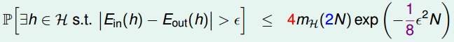

主要分以下三个步骤进行证明（具体参照LFD这本书，不感兴趣可以忽略不看）

------

**步骤①** 用$E_{in}^\prime$替代$E_{out}$

因为之前的$m(N)$均是建立在$N$的基础上进行分析的，因此无法直接运用于$E_{out}$，所以考虑用一个由虚拟的数据集$D^\prime$对应的$E_{in}^\prime$来取代$E_{out}$，替换的结果为：

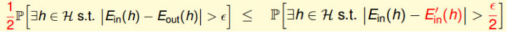

直观性解释：
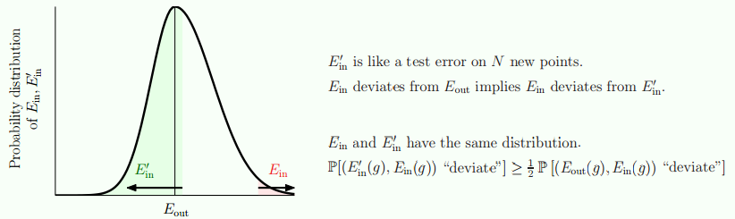

红色区域为$|E_{in}-E_{out}|\ large$的区域，绿色区域为$|E_{in}^\prime-E_{in}|\ large$的区域，而$E_{in}^\prime$取到绿色的区域$\approx1/2$，从而可以知道$P[|E_{in}-E_{out}|\ large]\approx2P[|E_{in}^\prime-E_{in}|\ large]$

证明：大前提---假设$P[sup_{h\in\mathcal{H}}|E_{in}(h)-E_{out}(h)|\gt\epsilon]\gt0$
① 其中(A.1)运用了$A\ and\ B\subset A\to P(A)\ge P(A\ and\ B)$
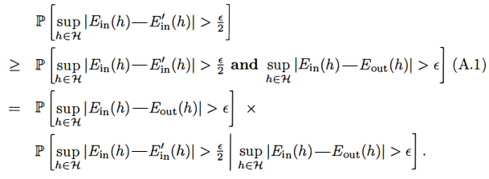

② 主要来考虑上式中的后一项，固定数据集$D$，令$h^*$表示任意一个使得$|E_{in}(h^*)-E_{out}(h^*)|\gt \epsilon$成立的假设函数，因为$E_{in}$是关于$D$的，而$E_{in}^\prime$是关于$D^\prime$的，所以$h^*$与$D$有关而与$D^\prime$无关。
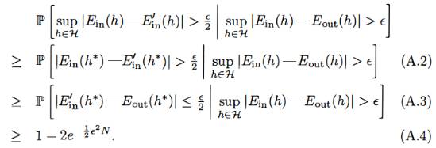

A.2：当$|E_{in}(h^\star)-E_{in}^\prime(h^\star)|\gt \epsilon/2$成立时，显然有$sup_{h\in\mathcal{H}}|E_{in}(h^\star)-E_{in}^\prime(h^\star)|\gt \epsilon/2$
A.3：由$|E_{in}(h^\star)-E_{out}(h^\star)|\gt \epsilon​$和$|E_{in}^\prime(h^\star)-E_{out}(h^\star)|\le \epsilon/2​$两个不等式可以导出$|E_{in}(h^\star)-E_{in}^\prime(h^\star)|\gt \epsilon/2​$（即如果A.3成立，则A.2必然成立），背后的公式即：$|A|\gt a,\ |B|\le a/2\to |A-B|\ge|B|-|A|\gt a/2​$
A.4：由于$h^*$是某个固定$D$情况下满足条件的假设函数，因此条件$sup_{h\in\mathcal{H}}|E_{in}(h)-E_{out}(h)|\gt\epsilon$满足条件的全部$h$对于$|E_{in}^\prime(h^\star)-E_{out}(h^\star)|\le \epsilon/2$均成立。所以等价于$\sum P[h_i]P[|E_{in}^\prime(h_i)-E_{out}(h_i)|\le \epsilon/2]$。这些$\sum P[h_i]=1$。因此可以直接使用Hoedffding不等式，其中采用了$P[A<a]=1-P[A\ge a]$

③ 假设$e^{(-1/2)\epsilon^2N}\lt 1/4$（这对于N较大时一般均满足），则有$1-2e^{(-1/2)\epsilon^2N}\gt 1/2$，所以将$1/2$代入①中便可证明替换结果成立。

**步骤②** 基于growth function对$\mathcal{H}$进行分类

由步骤①可知，问题已转换为求：$P[sup_{h\in\mathcal{H}}|E_{in}(h)-E_{in}^\prime(h)|\gt \epsilon/2]$
所以$\mathcal{H}$则被限制在两个大小为$N$的数据集$D\ and\ D^\prime$中，不妨定义一个大小为$2N$的数据集$S$，从中随机取出$N$个数为$D$，剩余的则为$D^\prime$。

经过这一步后的结果为：
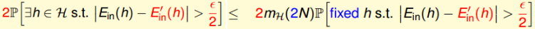

证明：
① 加入$S$条件，$S$代表$D$和$D^\prime$的并(不删除重复)，则对应问题就可以由下式表示
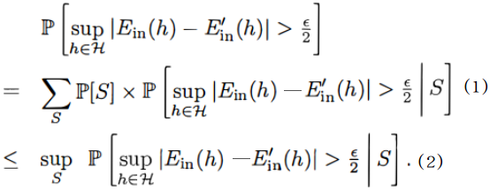
其中(1)到(2)中由于$P[S]\le 1$，从而利用概率的准则可知。

② 由前面growth function性质可知：假设函数集可以划分为$M$类，且满足$M\leq m_{\mathcal{H}}(2N)$（因为此时数据为$2N$项），所以问题就可以转变为：
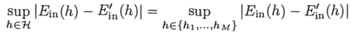
将其代入下面可知：
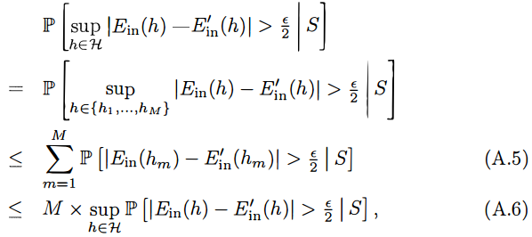
A.5：采用了并集的性质
A.6：进行了扩大，取为全部中的最大情况

③ 结合①②不难知，开始给出的结论成立

**步骤③** 基于无替换情况的Hoeffding不等式
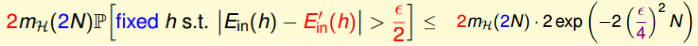
证明：
① 首先给出一种特殊情况下的Hoeffding不等式：令数据集$A=\{a_1,...,a_{2N}\}\ \ a_i\in[0,1]$，因此其均值为$\mu=\frac{1}{2N}\sum a_n$，从数据集$A$中不放回的取出$N$个数构成另一个数据集$D=\{z_1,...z_{N}\}$，则根据Hoeffding不等式可以知道（即容器中弹珠总数为2N，取出样本为N的情况）：
$$
P\big[|\frac{1}{N}\sum_{n=1}^{N}z_n-\mu|\gt\epsilon \big]\le2e^{-2\epsilon^2N}
$$
② 由$2N$个数据组成的数据集$S$，令$h(x_n)\ne y_n:a_n=1;\ h(x_n)= y_n:a_n=0$ 。类似①中情况，从数据集$S$中取出$N$个构成$D$，剩余的构成$D^\prime$，则有以下情况：
$$
E_{in}(h)=\frac{1}{N}\sum_{a_n\in D}a_n\ \ \ \ \ \ E_{in}^\prime(h)=\frac{1}{N}\sum_{a_n\in D^\prime}a_n^\prime
$$
又因为$S=D\cup D^\prime$，$D\cap D^\prime=\emptyset$，所以有下式：
$$
\mu=\frac{1}{2N}\sum_{n=1}^{2N}a_n=\frac{E_{in}(h)+E_{in}^\prime(h)}{2}\to E_{in}(h)-\mu=\frac{E_{in}(h)-E_{in}^\prime(h)}{2}
$$
所以①中特殊情况Hoeffding不等式代入可知：
$$
P[|E_{in}(h)-E_{in}^\prime(h)|\gt \frac{\epsilon}{2}]=P[2|E_{in}(h)-\mu|\gt\frac{\epsilon}{2}]=P[|E_{in}(h)-\mu|\gt\frac{\epsilon}{4}]\leq2e^{-2(\epsilon/4)^2N}
$$

结合步骤①②③，可以证明VC bound。

------

## VC维

### VC维理解

- VC维的定义：满足$m_{\mathcal{H}}(N)=2^N$的最大的$N$
- VC维取值准则：往往根据$d_{vc}=自由参数的数目$（比较通用的方式，但并不一定都适用）

### VC bound的再理解

① 模型复杂度惩罚
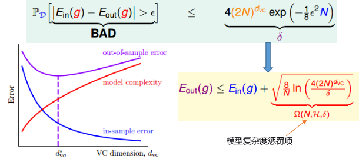
② VC bound比实际要宽松
理论上$N=10,000d_{vc}$情况下，学习才会比较好。但实际使用中$N=10d_{vc}$就能学的比较好了。主要原因有以下几个方面：
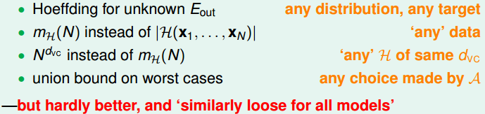

## 噪声和错误

### 噪声对VC bound的影响

VC bound依旧成立（都还是容器模型衍生出来）：

### 错误衡量

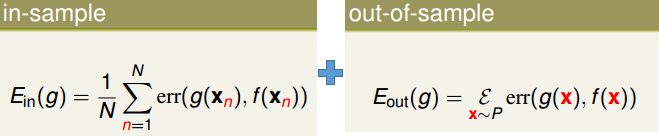

