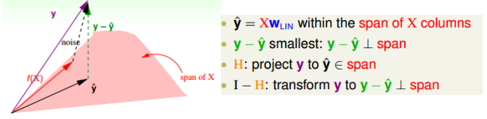
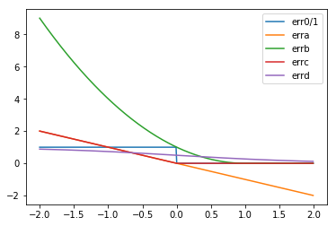

机器学习基石课后作业3-1：对应题目1～题目12

<!-- more-->

## 机器学习基石作业3

### 问题1

Q1~Q2：关于线性回归问题中$E_{in}$和$E_{out}$的理解
关于含有噪声的目标$y=w^T_fx+\epsilon$，其中的噪声$\epsilon$均值为0，方差为$\sigma^2$，且相互独立。根据PPT上的讲解可知，闭式解$w_{lin}$的$E_{in}$为：
$$
E_{in}(w_{lin})=\frac{1}{N}||\mathbb{y}-\hat{\mathbb{y}}||^2=\frac{1}{N}||(I-XX^{\dagger})\mathbb{y}||^2=\frac{1}{N}||(I-H)\mathbb{y}||^2
$$

从上图可知，$(I-H)\mathbb{y}=(I-H)noise$（这是基于只有$f(x)$含有噪声，$x$不含噪声的前提），从而问题转换为$E_{in}(w_{lin})=\frac{1}{N}||(I-H)noise||^2$。为了简化起见，令$A=(I-H)，B=noise\to ||AB||^2=scaler$，从而可以获得下面的式子（其中用到$BB^T=scaler$）：
$$
||AB||^2=trace((AB)^TAB)=trace(BB^TA^TA)\\
=BB^Ttrace(A^TA)=||noise||^2trace(A^TA)
$$
根据$H$的性质（具体证明等见Q2）可得：
$$
trace((I-H)^T(I-H))=trace(I-H)=N-(d+1)
$$
所以，综上所述可得：
$$
E_{in}(w_{lin})=(1-\frac{d+1}{N})||noise||^2
$$
Q1：当$\sigma=0.1,\ d=8$时，使得$E_{in}$的数学期望$\ge0.008$的样本数是多少？（从下述选项中选择满足条件情况下最小的）
a. 500	b. 25	c. 100	d. 1000	e. 10

A1：$E_{in}$的数学期望为：
$$
\mathbb{E}_D[E_{in}(w_{lin})]=(1-\frac{d+1}{N})\sigma^2
$$
从而相当于$(1-9/N)*0.01\ge 0.0008\to N=45$，从而选择N=100

Q2：针对hat matrix$H=X(X^TX)^{-1}X^T$性质的探究，以下哪些性质是$H$所具有的？
a. $H$是一个对称矩阵	b. $H$是一个幂等矩阵	c. $H$是一个半正定矩阵		d. $H$总是可逆		
e. $H$存在大于1的特征值	f. $H$有的d+1个特征值为1

A2：首先给出结论：$H$是①对称 ②幂等性 ③半正定 ④有d+1个特征值为1

证明：
①对称性：$H=(X(X^TX)^{-1}X^T)^T=X(X^TX)^{-1}X^T=H$（其中有用到$((AB)^{-1})^T=((AB)^T)^{-1}$，这条式子有可逆作为先决条件）
②幂等性：$H^2=X(X^TX)^{-1}X^TX(X^TX)^{-1}X^T=X(X^TX)^{-1}X^T=H$
③半正定：假设存在特征值和特征向量$Hw=\lambda w$，则$\lambda w=Hw=H^2w=\lambda Hw=\lambda^2w$，从而$\lambda^2w=\lambda w\to \lambda=0\ or \ 1$，所以全部特征值均$\ge 0$
④存在d+1个特征值为1：$trace(H)=trace(X(X^TX)^{-1}X^T)=trace((X^TX)^{-1}X^TX)=trace(I_{d+1\times d+1})=d+1$，又根据$trace(H)=\sum\lambda_i$（该项需要半正定和对称性作为条件，具体证明可见PRML），从而可知$\lambda=1$对应有$d+1$个。

这些结论可以用来证明$trace(I-H)=N-(d+1)$具体可自行推导

### 问题2

Q3~Q5：主要考察损失判据和随机梯度下降

存在以下集中损失判据函数：
a. $err(w)=(-yw^Tx)$
b. $err(w)=(max(0,1-yw^Tx))^2$
c. $err(w)=max(0,-yw^Tx)$
d. $err(w)=\theta(-yw^Tx)$

Q3：上述损失判据中，哪个是0/1判据$sign(w^Tx)\ne y$的上界（$y\in \{-1,+1\}$）？

A3：通过上述图像易知，errb即$err(w)=(max(0,1-yw^Tx))^2$为0/1判据的上界

Q4：上述损失判据中，哪个并不是处处可微分的？

A4：从图中也容易看出，errc即$err(w)=max(0,-yw^Tx)$在0处不可微分

Q5：对上述损失判据计算SGD（忽略不可微分的情况），哪个损失判据恰好是PLA中采用的（即其求梯度函数恰好为PLA中更新参数时用到的）？

A5：由PPT2可知，PLA的参数更新方程为$w\gets w+yx\ \ if\ sign(w^Tx)\neq y$，因此可以等价为$yw^Tx\gt 0,\ \nabla E=0,\ \ \ \ yw^Tx\lt 0,\ \nabla E=-yx$，从而满足此情况的为errc即$err(w)=max(0,-yw^Tx)$

### 问题3

Q6~Q10：主要考查二元情况下的导数和二阶泰勒展开

一阶导数：$\nabla f(x,y)=[\frac{\partial f}{\partial x},\frac{\partial f}{\partial y}]^T$
二阶导数：$\nabla^2 f(x,y)=[\frac{\partial^2 f}{\partial x^2},\frac{\partial^2 f}{\partial y\partial x}; \frac{\partial^2 f}{\partial y\partial x},\frac{\partial^2 f}{\partial y^2}]$
二阶泰勒展开：
$$
f(x+\Delta x, y+\Delta y)=f(x,y)+\Delta x\frac{\partial f(x,y)}{\partial x}+\Delta y\frac{\partial f(x,y)}{\partial y}\\
+\frac{1}{2!}\big[(\Delta x)^2\frac{\partial^2 f(x,y)}{\partial x^2}+2\Delta x\Delta y\frac{\partial^2 f(x,y)}{\partial x\partial y}+(\Delta y)^2\frac{\partial^2 f(x,y)}{\partial y^2}\big]
$$
主要针对表达式：
$$
E(u,v)=e^u+e^{2v}+e^{uv}+u^2-2uv+2v^2-3u-2v
$$
Q6：$\nabla E(u,v)$在$(u,v)=(0,0)$处的值时多少？

A6：根据一阶导数可得:
$$
\frac{\partial E(u,v)}{\partial u}=e^u+ve^{uv}+2u-2v-3\\
\frac{\partial E(u,v)}{\partial v}=2e^{2v}+ue^{uv}-2u+4v-2
$$
从而将$(u,v)=(0,0)$代入可得$\nabla E(0,0)=(-2,0)$

Q7：根据梯度下降算法（如下式所示），对参数进行迭代更新，求$\eta=0.01,(u_0,v_0)=(0,0)$经过五次迭代后的结果$(u_5,v_5)$和$E(u_5,v_5)$？
$$
(u_{t+1},v_{t+1})=(u_t,v_t)-\eta \nabla E(u_t,v_t)
$$
A7：直接根据简单的循环程序可解的$u= 0.094,v= 0.00179,E=2.8250$

Q8：如果我们采用二阶泰勒展开$\hat{E}_2(\Delta u,\Delta v)$来近似$E(u+\Delta u, v+\Delta v)$，求下述表达式中的参数在$(u,v)=(0,0)$处的值？
$$
\hat{E}_2(\Delta u,\Delta v)=b_{uu}(\Delta u)^2+b_{vv}(\Delta v)^2+b_{uv}(\Delta u)(\Delta v)+b_u\Delta u+b_v\Delta v+b
$$
A8：根据二阶导数的情况：
$$
\frac{\partial^2 E}{\partial u^2}=e^u+v^2e^{uv}+2\\
\frac{\partial^2 E}{\partial v^2}=4e^{2v}+u^2e^{uv}+4\\
\frac{\partial^2 E}{\partial u\partial v}=e^{uv}+vue^{uv}-2
$$
将这些一阶和二阶导数代入二阶泰勒展开，最后可得参数为$(1.5,4,-1,-2,0,3)$

Q9：将Hessian矩阵表示为$\nabla^2E(u,v)​$，并假设该Hessian矩阵为正定的。以下哪个时最佳的$(\Delta u,\Delta v)​$使得$\hat E_2​$取到最小值？（这个方向称之为Newton Direction）

A9：找使得$\hat E_2$最小的$(\Delta u,\Delta v)$，可以直接通过求导获得。分别对$\Delta u$和$\Delta v$求导，结果如下：
$$
\frac{\partial E_2}{\partial \Delta u}=\frac{\partial E}{\partial u}+\Delta u\frac{\partial^2 E}{\partial u^2}+\Delta v\frac{\partial^2 E}{\partial u\partial v}=0\\
\frac{\partial E_2}{\partial \Delta v}=\frac{\partial E}{\partial v}+\Delta v\frac{\partial^2 E}{\partial v^2}+\Delta u\frac{\partial^2 E}{\partial u\partial v}=0
$$
联立上述两式，并将$(\Delta u,\Delta v)$以向量形式提取出来可以化简为：
$$
(\Delta u,\Delta v)^T=-(\nabla^2E)^{-1}\nabla E
$$
Q10：对$(u_0,v_0)$利用Newton Direction（无$\eta$）进行参数更新，五轮更新后$(u_5,v_5)$和$E$结果为？

A10：通过简单的程序可得$u= 0.6118,v= 0.0705,E=2.3608$
从该结果可见，采用Newton Direction进行参数更新速度更快，但是代价是求Hessian矩阵

### 问题4

Q11~Q12：关于特征转换的问题

Q11：考虑二维空间上的6个点：$x_1=(1,1),x_2=(1,-1),x_3=(-1,-1),x_4=(-1,1),x_5=(0,0),x_6=(1,0)$，采用二次函数，线性函数的并集的hypotheses，能最多shatter里面几个点。

A11：二次函数和线性函数组合的“最强形态”为$(1,x_1,x_2,x_1^2,x_2^2,x_1,x_2)$，则将此6个点转到6维空间上，可获得矩阵为：该矩阵为满秩矩阵，因此6个点能被shatter。

    [[ 1  1  1  1  1  1]
     [ 1  1 -1  1 -1  1]
     [ 1 -1 -1  1  1  1]
     [ 1 -1  1  1 -1  1]
     [ 1  0  0  0  0  0]
     [ 1  1  0  1  0  0]]

Q12：假设转换之前预先“偷看”了所有$N$个数据，并定义一种特殊的特征转换，将$x\in \mathbb{R}^d\to z\in\mathbb{R}^N$
$$
(\Phi(x))_n=z_n=[x=x_n]
$$
利用线性分类器对转换后的特征进行处理，求$d_{vc}(H_{\Phi})$

A12：这题的关键在于理解这种“奇葩”的特征转换，举个例子，如第1个数据$x_1$，根据上述规则则变为$[1,0,...,0]^T$，（矩阵大小$N\times1$）就是将第几个数对应的行置为1，其他行均为0。显然，不管多少数，其转换后的向量均是线性无关的，因此均可以被shatter，所以$d_{vc}(H_\Phi)=\infty$

