机器学习基石Lec9-Lec12主要知识点：对应作业3
<!-- more -->

## 线性回归

### 线性回归基础

① 误差定义：
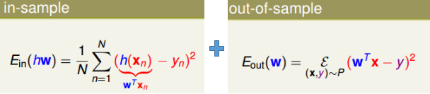
② 优化目标和其对应梯度
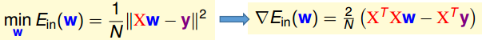
往往直接通过$\nabla E_{in}=0$来获得最佳的参数$w_{lin}=(X^TX)^{-1}X^TY$

### 线性回归算法

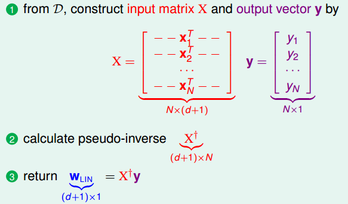

### 泛化能力分析

针对$E_{in}$和$E_{out}$的数学期望如下(具体推导见作业)：
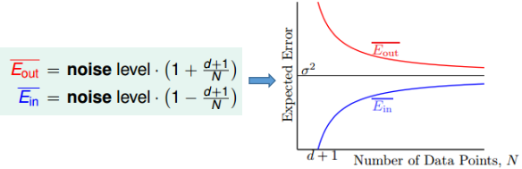
可见，当$N\to\infty$时，两者都逼近$\sigma^2$

### 基于线性回归的二分类问题

易知$err_{0/1}\le err_{sqr}$，（$err_{0/1}=[sign(w^Tx)\ne y]$，$err_{sqr}=(w^Tx-y)^2$）从而有下面的关系：

可见，线性回归是二元分类问题的上界。但线性回归求参数$w$非常快(因为直接闭式解)，从而往往将其作为分类器的初始值

## Logistic回归

### Logistic函数

令$s=w^Tx$：
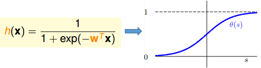

### Logistic回归基础

目标函数和梯度函数（目标函数通过cross-entropy获得）
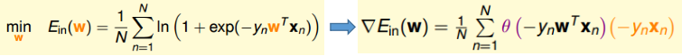
由于梯度闭式解不能直接求出，又由于$\nabla E_{in}$是关于$w$的凸函数，所以采用梯度下降法来更新参数

### Logistic回归算法

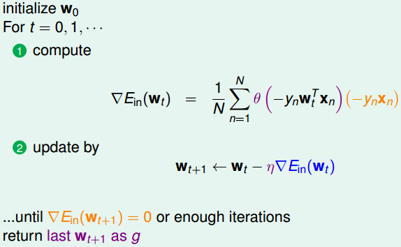
其中参数$\eta$作为一个超参数，需自己设定（可以通过实验等手段来寻找最佳$\eta$）

### 梯度下降法介绍

梯度下降法的核心思想在于“一阶泰勒展开的运用”：具体的推导过程见下图
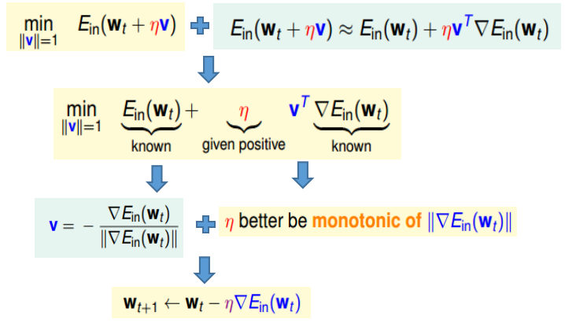

## 基于线性模型的分类

### 三种线性模型比较

① 各自具体函数形式及对应的损失判据（其中$s=w^Tx$）：
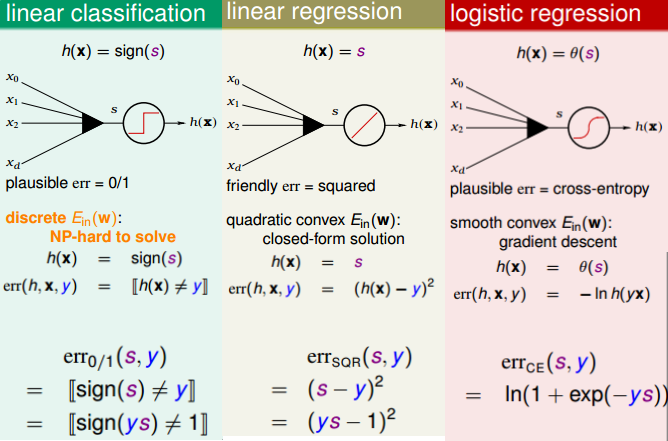
② 对应的损失函数图：
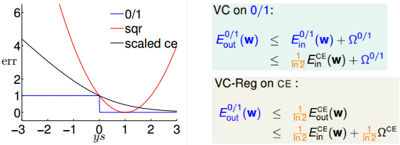
上述情况可见：当惩罚项$\Omega$在可接受范围内时，$E_{in}^{CE}\ small\to E_{out}^{CE}\ small\to E_{out}^{0/1}\ small$，从而说明利用Logistic回归进行分类是可行的。

### 随机梯度下降法

​	真实情况下的梯度为：$\frac{1}{N}\sum_{n=1}^N\nabla err(w,x_n,y_n)=\mathcal{E}_{n}\nabla err(w,x_n,y_n)$。为了增加运算速度，采用随机选取一个数据$m$，用$\nabla err(w,x_m,y_m)$来代替上述的梯度。

- 优点：简单，速度更快。且在数据量很大和在线学习(online learning)中非常有用
- 缺点：相比原本的梯度下降法，稳定性要差一些（这也是为什么batch SGD更常见）

### 多类别分类问题

**方式1：一对多**
算法：
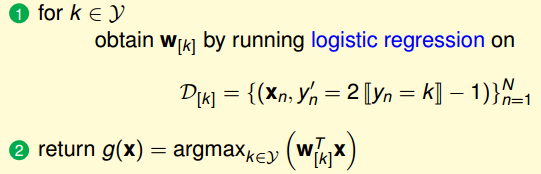
特点：
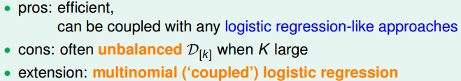

**方式2：一对一**
算法：
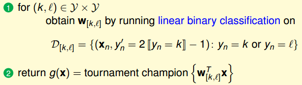
特点：
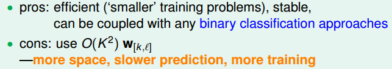

## 非线性转换

### 处理非线性可分问题的步骤

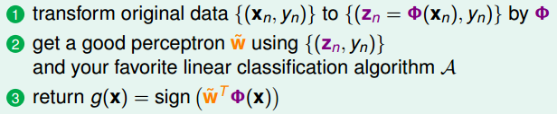

### 非线性转换的代价

- 增加了$d_{VC}$，即增加了模型复杂度
- 增加了计算量和存储空间，因为“自由参数”增加