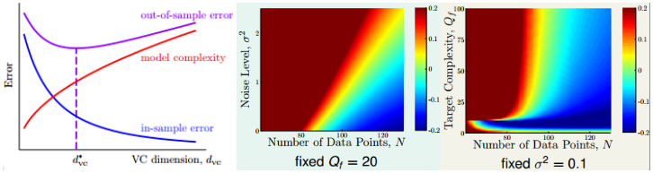
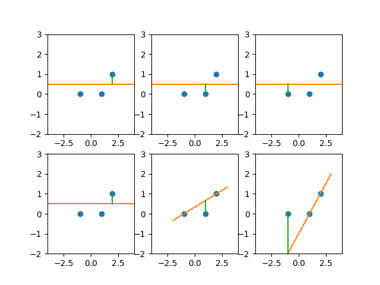

机器学习基石课后作业4-1：对应题目1～题目12
<!-- more -->

## 机器学习基石作业4

### 问题1

关于过拟合和Deterministic noise的问题。假设目标量为$y=f(\mathbb{x}+\epsilon)\sim Gaussian(f(x),\sigma^2)$

noise主要分为两大类：① Stochastic noise --- 来自于外界的“干扰”，属于不可消除性noise  ② Deterministic noise --- 来自于潜在目标函数$f$与假设函数集中最优函数$h^{\star}\in \mathcal{H}$的差异(也可以简单的说为假设函数集能力不够，达不到目标函数)。

关于过拟合问题主要可从上述三幅图来思考。图(2)(3)$Q_f$代表目标函数的最高次幂为多少(假设目标函数为多项式)，颜色区域的值代表$E_{out}(g_{10})-E_{out}(g_2)$(理解为复杂假设函数集-简单假设函数集训练后的误差)

Q1：Deterministic取决于假设函数集$\mathcal{H}$，假设$\mathcal{H}^,\subset \mathcal{H}$，且$f$固定，则一般而言，采用$\mathcal{H}^,$取代$\mathcal{H}$，deterministic noise将如何变化

A1：由于Deterministic noise可以理解为假设函数集能够“逼近”目标函数的能力（能力越强，值越小），因此对于越大的假设函数集，其能力越强，所以一般而言，deterministic noise在此种情况下会增加

### 问题2

Q2：多项式模型可以视为线性模型在$\mathcal{Z}$空间上的运用，即采用非线性转换$\Phi:\mathcal{X}\to\mathcal{Z}$，此问题中将标量$x$转换为向量$z$，采用的转换规则为$z=(1,L_1(x),L_2(x),...,L_Q(x))$（关于$L_i(x)$的详细表达式见PPT）。
将假设函数集表示为$H_Q=\big\{h|h(x)=w^Tz=\sum_{q=0}^{Q}w_1L_q(x)\big\}$，其中$L_0(x)=1$。定义$\mathcal{H}(Q,c,Q_0)={h|h(x)=q^Tz\in H_Q;w_q=c\ for\ q\ge Q_0}$，则下述表达式中哪条是正确的？
a. $\mathcal{H}(10,0,3)\cup\mathcal{H}(10,1,4)=\mathcal{H}_3$
b. $\mathcal{H}(10,1,3)\cup\mathcal{H}(10,1,4)=\mathcal{H}_1$
c. $\mathcal{H}(10,0,3)\cup\mathcal{H}(10,0,4)=\mathcal{H}_2$
d. $\mathcal{H}(10,0,3)\cup\mathcal{H}(10,0,4)=\mathcal{H}_4$

A2：该问题中$c=0$才会有比较实际的意义，因此主要验证下含有$c=0$的项，不难知道(c)对

### 问题3

Q3：含权值惩罚项的正则项，具体表达式如下所示(其中$\lambda\gt 0$)
$$
E_{aug}(w)=E_{in}(w)+\frac{\lambda}{N}w^Tw
$$
如果我们希望通过梯度下降法来更新参数，具体的参数更新表达式是什么？

A3：$\nabla E_{aug}$：$\nabla E_{in}+\frac{2\lambda}{N}w$，从而不难获得参数更新规则如下为
$$
w(t+1)\gets \big(1-\frac{2\lambda\eta}{N}\big)w(t)-\eta\nabla E_{in}(w(t))
$$
Q4：$w_{lin}$为普通线性回归问题的最优解，$w_{reg}$是加入了正则项之后的最优解，则两者之间有什么关系？

A4：根据课程可知，正则项表达式本质上是通过下述表达式“推导”而来的（两者等价）
$$
min\ E_{in}(w)=\frac{1}{N}(Zw-y)^T(Zw-y)\ \ \ s.t.\ \ w^Tw\le C
$$
从上式显然可见，若$w_{lin}$满足$w^Tw\le C$这个条件，则$w_{lin}=w_{reg}$，否则，$\|w_{lin}\|\ge \|w_{reg}\|$，且随着$C$的减小(对应$\lambda$增大)相应的似然函数集满足$w的值域(小C)\subset w的值域(大C) $。所以选择$\|w_{reg}(\lambda)\|$是关于$\lambda$的非增函数。

### 问题4

留一交叉验证背后的思想：可以在一定程度上反映$E_{out}$：$E_{loocv}(\mathcal{H},A)$的数学期望能够近似$E_{out}(g^-)$的数学期望，推导表达式如下（其中①$\mathcal{E}$表示数学期望②$D_n=D_{train}，D_n+(x_n,y_n)=D$③$e_n=err(g_n^-(x_n),y_n)$）：
$$
\mathcal{E}_{D}E_{loocv}(\mathcal{H},A)=\mathcal{E}_D\frac{1}{N}\sum_{n=1}^Ne_n=\frac{1}{N}\sum_{n=1}^N\mathcal{E}_De_n=\frac{1}{N}\sum_{n=1}^N\mathcal{E}_{D_n}\mathcal{E}_{(x_n,y_n)}err(g_n^-(x_n),y_n)\\
=\frac{1}{N}\sum_{n=1}^N\mathcal{E}_{D_n}E_{out}(g^-_n)=\frac{1}{N}\sum_{n=1}^N\bar{E}_{out}(g^-_n)=\bar{E}_{out}(g^-_n)=\bar{E}_{out}(N-1)
$$
上面式子中$\mathcal{E}_{(x_n,y_n)}err(g_n^-(x_n),y_n)=E_{out}(g_n^-)$是根据$E_{out}$的定义来的。
上式说明了可以用leave-one-out来近似$E_{out}(g)$(因为整体而言少了一个数据，但当N很大时，几乎可以忽略差别)，但代价是运算成本开销增大。

Q5：有三个数据点$(-1,0),(1,0),(\rho,1),\rho\ge0$，则对于两个模型：①$h_0(x)=b_0$ ②$h_1(x)=a_1x+b_1$，在$\rho$取何值时，两者的$E_{loocv}(in)$相等？

A5：直接通过$E=\frac{1}{3}(e_1+e_2+e_3)$来进行计算，容易发现$e_1$两者等价，且对于情况①$e_2=e_3=1/4$，所以只需情况②中$e_2+e_3=1/2$便可，从而问题可以转换为(线性方程求解代入等过程略)：
$$
\big(\frac{2}{\rho+1}\big)^2+\big(\frac{-2}{\rho-1}\big)^2=\frac{1}{2}\to\rho=\sqrt{9+4\sqrt{6}}
$$

### 问题5

关于学习的三大准则：
a). Occam's Razor：能够拟合数据的模型中，越简单的模型越具有说服力
b). Sampling Bias：如果训练样本和测试样本(以及后续的预测问题)的数据不是来自于同一分布，则训练的结果往往是不可信的
c). Data Snooping(偷窥数据)：要尽可能的避免或减少对数据的“偷窥”，在很多情况下，会有意无意的间接加入了“人的预处理”而对资料产生污染

Q6：一封包含接下来5周每周1棒球比赛胜负的结果的邮件，这封邮件告诉你如果你想看第6周比赛的胜负，需支付1000元，下述哪条分析是对的？
a). 如果要保证至少有一封邮件对5周棒球比赛预测结果是对的，至少要发出64封邮件(在5场比赛出结果之前)
b). 在第一场比赛结果出来后，邮件发送者应该再发几封邮件给剩下的人

A6：5场都没出结果时：$2^5=32$。1场出了结果：$2^4=16$，之后依次除以2即可

Q7：如果发送一封邮件需10元，如果5周过后有一位收件人寄来1000元，则该发件人的这次骗局能赚多少钱？

A7：总共花费$cost=10(2^5+2^4+2^3+...,2^1+1)=630$，所以$get=1000-630=370$

### 问题6

Q8~Q10：银行一开始有一个非常简陋的“评判标准”$a(x)$来确定是否对某人$x$发放信用卡，对$N=10,000$个人采用$a(x)$标准决定是否发放信用卡，因此，现在手头的数据有$(x_1,y_1),...,(x_N,y_N)$。在你看到这些数据之前，厉害的你已经通过数学推导等手段建立了一个信用卡发放与否的评价函数$g$，然后你将其用到这些有的数据上，发现结果几乎完美。

Q8：你的似然函数集$M$是多少？

A8：由于时建立了一个评价函数，因此，似然函数集$M=1$

Q9：在此$M$下，$N=10,000$情况下，通过Hoeffding bound计算误差大于$1\%$的概率为多少？

A9：由于$M=1$，因此就等价于使用Hoeffding不等式：$P[|E_{in}-E_{out}|\gt\epsilon]\le2exp(-2\epsilon^2N)$，将具体数值代入可解得$P\leq0.271$

Q10：银行采用你的评价函数$g$，结果发现在后续人中效果很差，超过半数办理信用卡的人存在欺诈行为。则如何“搭配”$a(x)$和你的$g(x)$作为评价体系会有较好的效果？

A10：$g(x)$效果很差的根本原因在于使用了“污染”的数据，因为$Data$全部都是来自于$a(x)$获得的标签$y$，并不是真实可信的。但是$g(x)$又能够很好的预测来自$a(x)$的数据，因此一种好的预测方式是，如果能通过$a(x)$的测试，则再进一步进行$g(x)$的测试（因为$g(x)$对$a(x)$的结果预测效果好）。因此$a(x)\ AND\ g(x)$，即两者都说“可信”的情况下，真实情况一般而言是好的。

### 问题7

Q11~Q12：虚拟样本和正则化：考虑线性回归问题，如果我们加入K个虚拟样本$(\tilde{x}_1,\tilde{y}_1),...,(\tilde{x}_K,\tilde{y}_K)$，然后我们解下述方程：
$$
min_w \frac{1}{N+K}\big(\sum_{n=1}^N(y_n-w^Tx_n)^2+\sum_{k=1}^K(\tilde{y}_k-w^T\tilde{x}_n)^2\big)
$$
这些虚拟样本可以视为一种“另类”的正则化。

Q11：使得上述问题得到最优解的$w$是多少？

A11：对上式求导，再另其导数=0求出$w$，求解的结果为$w=(X^TX+\tilde{X}^T\tilde{X})^{-1}(X^TY+\tilde{X}^T\tilde{Y})$

Q12：当$\tilde{X},\tilde{Y}$取何值时，上述表达式获得的$w$与下述0正则化完全一样？
$$
w_{reg}=argmin_w\frac{\lambda}{N}||w||^2+\frac{1}{N}||Xw-y||^2
$$
A12：简单的将A11的结果与上式对比就可知：$\tilde{X}=\sqrt{\lambda}I,\tilde{Y}=0$