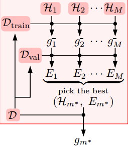

机器学习基石课后作业4-2：对应题目13～题目20
<!-- more -->

## 机器学习基石作业4

## 问题8

Q13~Q20：主要考虑了加入正则项后的线性回归问题，超参数的选择问题和交叉验证的方法。

### 算法说明

加入正则项的线性回归问题（基本原理与线性回归一致，也存在闭式解）：
$$
w_{reg}=argmin_w\frac{\lambda}{N}||w||^2+\frac{1}{N}||Xw-Y||^2=(X^TX+\lambda I)^{-1}X^TY
$$


超参数的选择：

>一系列超参数的集合$L=\lambda_1,...\lambda_K$
>For i=1,2,...K:
>​	①计算每一种超参数下的$w_{reg}$
>​	②利用此$w_{reg}$求解$E_{in}$和$E_{out}$（有时还加上$E_{val}$）
>​	③根据一定评价标准(常用$E_{val}$来进行选择)
>返回最佳的$\lambda$

交叉验证方法：

>将数据划分为K份
>For t=1,2,...,K:
>​	①将第t份作为验证集，其他的作为训练集
>​	②通过训练集训练求出$w_{reg}$
>​	③求解该$w_{reg}$情况下训练集和验证集的误差
>将所有训练集和验证集的误差取均值
>返回误差

交叉验证往往被用来作为超参数选择的策略。也是评价假设函数集好坏的有效方法。

### 具体问题

```python
# 数据导入模块
def loadData(filename):
    data = pd.read_csv(filename, sep='\s+', header=None)
    data = data.as_matrix()
    col, row = data.shape
    X = np.c_[np.ones((col, 1)), data[:, 0: row-1]]
    Y = data[:, row-1:row]
    return X, Y
```
```python
# 误差计算函数
def mistake(X, Y, theta):
    yhat = np.sign(X.dot(theta))
    yhat[yhat == 0] = -1
    err = np.sum(yhat != Y)/len(Y)
    return err
```
Q13：取$\lambda=10$的情况下时，对应的$E_{in}$和$E_{out}$分别是多少？（采用0/1判据）

A13：结果如下所示

```python
# Q13 --- lambda=10的情况
X, Y = loadData('hw4_train.dat')
Xtest, Ytest = loadData('hw4_test.dat')
lamb = 10
row, col = X.shape
wreg = lin.pinv(X.T.dot(X)+lamb*np.eye(col)).dot(X.T).dot(Y)
ein = mistake(X, Y, wreg)
eout = mistake(Xtest, Ytest, wreg)
print('Ein: ',ein,'Eout: ',eout)
```

    Ein:  0.05 Eout:  0.045

Q14&Q15：分别采用$log_{10}\lambda=\{2,1,0,-1,...,-8,-9,-10\}$，对应最小$E_{in}$和最小$E_{out}$情况下的$\lambda$是多少？（如果存在多个相同答案时，选择相同情况下最大的$\lambda$）

A14&A15：结果如下

```python
# Q14和Q15 --- 不同lambda情况下选择最佳的lambda
arr = np.arange(-10, 3, 1); num =len(arr)
lamb = 10.0**arr
ein = np.zeros((num,)); eout = np.zeros((num,)); evali = np.zeros((num,))
for i in range(num):
    wreg = lin.pinv(X.T.dot(X) + lamb[i] * np.eye(col)).dot(X.T).dot(Y)
    ein[i] = mistake(X, Y, wreg)
    eout[i] = mistake(Xtest, Ytest, wreg)
out = np.c_[np.c_[np.array(lamb),ein],eout]
print('\tlambda\t\t Ein\t\t Eout')
print(out)
```

    	  lambda		       Ein		       Eout
    [[  1.00000000e-10   1.50000000e-02   2.00000000e-02]
     [  1.00000000e-09   1.50000000e-02   2.00000000e-02]
     [  1.00000000e-08   1.50000000e-02   2.00000000e-02]
     [  1.00000000e-07   3.00000000e-02   1.50000000e-02]
     [  1.00000000e-06   3.50000000e-02   1.60000000e-02]
     [  1.00000000e-05   3.00000000e-02   1.60000000e-02]
     [  1.00000000e-04   3.00000000e-02   1.60000000e-02]
     [  1.00000000e-03   3.00000000e-02   1.60000000e-02]
     [  1.00000000e-02   3.00000000e-02   1.60000000e-02]
     [  1.00000000e-01   3.50000000e-02   1.60000000e-02]
     [  1.00000000e+00   3.50000000e-02   2.00000000e-02]
     [  1.00000000e+01   5.00000000e-02   4.50000000e-02]
     [  1.00000000e+02   2.40000000e-01   2.61000000e-01]]

Q16&Q17：将训练集划分为$D_{train}:120$和$D_{val}:80$。通过$D_{train}$获得$g_{\lambda}^-$，再通过$D_{val}$对其进行验证。求不同超参数$\lambda$情况下使得$E_{train}(g_\lambda^-)$最小的$\lambda$和使得$E_{val}(g_\lambda^-)$最小的$\lambda$

A16&A17：结果如下

```python
# Q16和Q17
Xtrain = X[0:120, :]; Ytrain = Y[0:120, :]
Xval = X[120:, :]; Yval = Y[120:, :]
ein = np.zeros((num,)); eout = np.zeros((num,)); evali = np.zeros((num,))
for i in range(num):
    wreg = lin.pinv(Xtrain.T.dot(Xtrain) + lamb[i] * np.eye(col)).dot(Xtrain.T).dot(Ytrain)
    ein[i] = mistake(Xtrain, Ytrain, wreg)
    eout[i] = mistake(Xtest, Ytest, wreg)
    evali[i] = mistake(Xval, Yval, wreg)
out = np.c_[np.c_[np.c_[np.array(lamb),ein],evali],eout]
print('\tlambda\t\t  Ein\t\t  Eval\t\t  Eout')
print(out)
```

    	   lambda		       Ein		      Eval		        Eout
    [[  1.00000000e-10   8.33333333e-03   1.25000000e-01   4.00000000e-02]
     [  1.00000000e-09   0.00000000e+00   1.00000000e-01   3.80000000e-02]
     [  1.00000000e-08   0.00000000e+00   5.00000000e-02   2.50000000e-02]
     [  1.00000000e-07   3.33333333e-02   3.75000000e-02   2.10000000e-02]
     [  1.00000000e-06   3.33333333e-02   3.75000000e-02   2.10000000e-02]
     [  1.00000000e-05   3.33333333e-02   3.75000000e-02   2.10000000e-02]
     [  1.00000000e-04   3.33333333e-02   3.75000000e-02   2.10000000e-02]
     [  1.00000000e-03   3.33333333e-02   3.75000000e-02   2.10000000e-02]
     [  1.00000000e-02   3.33333333e-02   3.75000000e-02   2.10000000e-02]
     [  1.00000000e-01   3.33333333e-02   3.75000000e-02   2.20000000e-02]
     [  1.00000000e+00   3.33333333e-02   3.75000000e-02   2.80000000e-02]
     [  1.00000000e+01   7.50000000e-02   1.25000000e-01   8.00000000e-02]
     [  1.00000000e+02   3.41666667e-01   4.12500000e-01   4.14000000e-01]]
Q18：将Q17中(对应$E_{val}$最小)的$\lambda$作用于整个数据集获得$g_\lambda$，在计算此时的$E_{in}(g_\lambda)$和$E_{out}(g_\lambda)$

A18：结果如下

```python
# Q18
lambmin = lamb[np.where(evali == np.min(evali))[0][-1]]
wreg = lin.pinv(X.T.dot(X) + lambmin * np.eye(col)).dot(X.T).dot(Y)
errin = mistake(X, Y, wreg)
errout = mistake(Xtest, Ytest, wreg)
print('Ein: ',errin,'Eout: ',errout)
```

    Ein:  0.035 Eout:  0.02

Q19：将数据划分为5份，进行交叉验证，对于不同的$\lambda$情况，求使得$E_{cv}$最小的的$\lambda$

A19：结果如下

```python
# Q19
ein = np.zeros((num,)); eout = np.zeros((num,))
for j in range(num):
    for i in range(5):
        Xval = X[40*i:40*(i+1), :]
        Yval = Y[40*i:40*(i+1), :]
        Xtrain = np.r_[X[0:40*i, :], X[40*(i+1):, :]]
        Ytrain = np.r_[Y[0:40*i, :], Y[40*(i+1):, :]]
        wreg = lin.pinv(Xtrain.T.dot(Xtrain) + lamb[j] * np.eye(col)).dot(Xtrain.T).dot(Ytrain)
        ein[j] += mistake(Xval, Yval, wreg)
    ein[j] /= 5
out = np.c_[np.array(lamb), ein]
print('\tlambda\t\t  Ecv')
print(out)
```

    	  lambda		       Ecv
    [[  1.00000000e-10   5.00000000e-02]
     [  1.00000000e-09   5.00000000e-02]
     [  1.00000000e-08   3.00000000e-02]
     [  1.00000000e-07   3.50000000e-02]
     [  1.00000000e-06   3.50000000e-02]
     [  1.00000000e-05   3.50000000e-02]
     [  1.00000000e-04   3.50000000e-02]
     [  1.00000000e-03   3.50000000e-02]
     [  1.00000000e-02   3.50000000e-02]
     [  1.00000000e-01   3.50000000e-02]
     [  1.00000000e+00   3.50000000e-02]
     [  1.00000000e+01   6.00000000e-02]
     [  1.00000000e+02   2.90000000e-01]]
Q20：求上述$\lambda$(Q19)对应的$E_{in}(g_\lambda)$和$E_{out}(g_\lambda)$

A20：结果如下

```python
# Q20
lambmin = lamb[np.where(ein == np.min(ein))[0][-1]]
wreg = lin.pinv(X.T.dot(X) + lambmin * np.eye(col)).dot(X.T).dot(Y)
errin = mistake(X, Y, wreg)
errout = mistake(Xtest, Ytest, wreg)
print('Ein: ',errin,'Eout: ',errout)
```

    Ein:  0.015 Eout:  0.02