机器学习基石Lec13-Lec16主要知识点：对应作业4
<!-- more -->

## 过拟合的危害

### 过拟合和欠拟合

- 过拟合定义：$E_{in}$足够小，但是$E_{in}$和$E_{out}$相差甚远（常常发生在$d_{VC}\gt d_{VC}^\star$）
- 欠拟合定义：$E_{in}$和$E_{out}$均过大（常常发生在$d_{VC}\lt d_{VC}^\star$

### 导致过拟合的几大主要原因

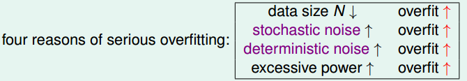

### Stochastic noise和deterministic noise

- Stochastic noise：属于“不可控”因素，来自于外界对数据的污染
- Deterministic noise：可以视为假设函数集中最佳函数$h^\star$与潜在目标函数$f$的差异。与假设函数集有关，因此属于“可控”因素

以下是针对$y=f(x)+\epsilon\sim Gaussin(\sum_{q=0}^{Q_f}\alpha_qx^q,\sigma^2)$为目标函数情况下的实验（其中坐标轴上每个点的数值表示$E_{out}(g_{10})-E_{out}(g_2)$的结果）

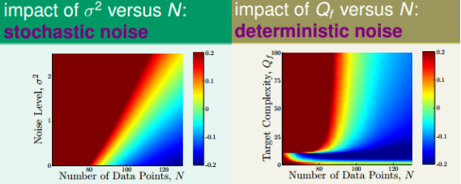

从上述图像可知：并不是假设函数集越复杂越好，需要视实际拥有的数据量$N$等情况而定。

### 解决过拟合的几个方法

- 数据修正：对错误的标签进行修正
- 数据筛选：剔除一些错误或“不良”数据
- 添加“伪数据”：通过旋转平移等手段来增加数据量
- 正则化
- .......

## 正则化

### 基本思想

通过对参数$w$加入一些约束，从而起到减少假设函数集中假设函数的数量，从而有效减少了假设函数的复杂度。

常见正则化的两种等价形式：
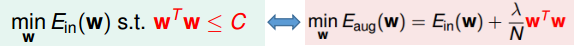

### 正则化背后的VC理论

解释①：直接的减少了模型的复杂度$\Omega(\mathcal{H}(C))\lt \Omega(\mathcal{H})$
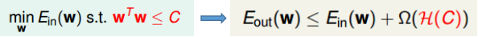
解释②：间接地减少了模型的复杂度：
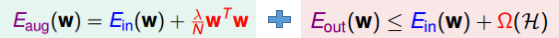
将$\frac{\lambda}{N}w^Tw$视为“关于$w$的复杂度度量”$\frac{\lambda}{N}\Omega(w)$，从而上述两边结合等价于：
$$
E_{out}(w)\leq E_{aug}(w)-\frac{\lambda}{N}\Omega(w)+\Omega(\mathcal{H})
$$
从而相比$E_{in}$，$E_{aug}$更加近似$E_{out}$

### 常见的正则项$\Omega(w)$

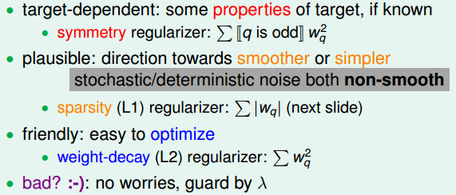

关于$\lambda$的选择：$\lambda$可以调整正则项能力的强弱，$\lambda$越大，正则项作用越大。当噪声(无论deterministic noise或者stochastic noise)越大时，相对而言，$\lambda$可以调整的大一点

## 验证方式

### 利用验证集选择模型

**基本框架**（$K$代表验证集含有的数据量）：
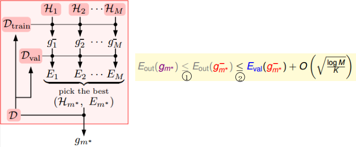
不等式①可以根据复杂度$\Omega(N,\mathcal{H},\delta)$与$N$有关，$N$越大，值越小可得。
不等式②则将$E_{val}$看成$E_{in}$，则就是VC bound

**存在的矛盾**
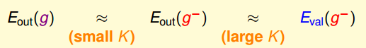
当$K$过大时：$g^-$远差于$g$，因此不能够代表选择的$\mathcal{H}$是“最佳的”
当$K$过小时：$E_{val}(g^-)$与$E_{out}(g^-)$，则通过$E_{val}$的大小选出来的最佳$\mathcal{H}$，对测试集而言并非“最佳的”

实践中，常取$K=N/5$

### 常见的交叉验证的方式

**留一交叉验证**

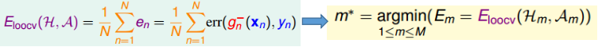

优点：理论上$E_{loocv}$的数学期望可以代表$E_{out}(g^-)$的数学期望，证明见作业
缺点：计算开销大；不稳定

**留一份交叉验证**

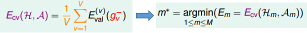

将数据划分为$V$份（实践中往往$V=5\ or\ 10$）

## 三个学习准则

### Occam's Razor for Learning

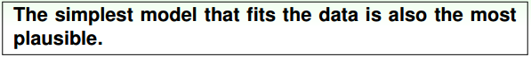

### Sampling Bias

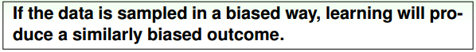

### Data Snooping

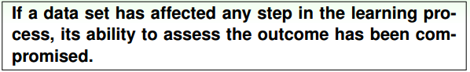

