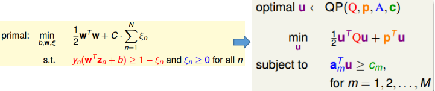
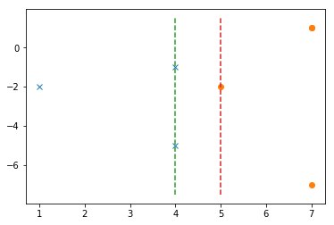
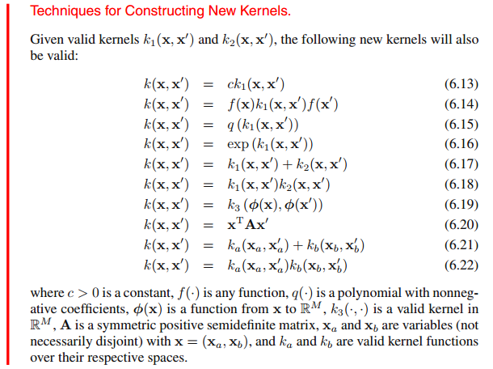
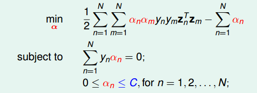

机器学习技法课后作业1-1：对应题目1～题目14
<!-- more -->

## 机器学习技法作业1

### 问题1

Q1：输入空间为$d$维，输入数据量为$N$。求soft-margin支撑向量机基本形式(非对偶形式)情况下是变量为多少的二次规划问题？

A1：基本形式的soft-margin支撑向量机和QP方法如下图所示

将$C$视为超参数，人工预先确定，从而未知量就为$w:d,\ b:1,\ \xi:N$，从而变量数为$N+d+1$

### 问题2

Q2：有以下7个数据集
$$
\{x_1=(1,0),y_1=-1\}, \{x_2=(0,1),y_2=-1\},\{x_3=(0,-1),y_3=-1\}\\
\{x_4=(-1,0),y_4=+1\},\{x_5=(0,2),y_5=+1\}, \{x_6=(0,-2),y_6=+1\}, \{x_7=(-2,0),y_7=+1\}
$$

采用下述的非线性转换将其转换到：$z=(\Phi_1(x),\Phi_2(x))$
$$
\Phi_1(x)=x_2^2-2x_1+3,\ \Phi_2(x)=x_1^2-2x_2-3
$$
则在$z$空间上，最佳的分割超平面为多少？

A2：将数据点在$z$超平面上的结果绘制如下：

从而可得最佳超平面为$z_1=4.5$

### 问题3

Q3：与Q2中的数据集一致，但是通过kernel函数的形式$K(x,x^\prime)=(1+x^Tx^\prime)^2$进行特征转换。采用hard-margin的支撑向量机对该问题进行处理。利用$(\alpha_1,...,\alpha_7)$来表示对偶形式中引入的“对偶参数”。以下对于最佳情况下$(\alpha_1,...,\alpha_7)$的结果描述正确的是：
(a). $max_{1\le n\le7}\alpha_n=\alpha_7$	(b). 存在6个非零的$\alpha_n$	(c). $\sum_{n=1}^7\alpha_n=5$	(d). $min_{1\le n\le7}\alpha_n=\alpha_7$

A3：利用程序获得的结果如下所示：

    支撑向量对应下标： [1 2 3 4 5] 
    对应的alpha*y： [[-0.64491963 -0.76220325  0.88870349  0.22988879  0.2885306 ]] 
     截距b:  [-1.66633141]
### 问题4

Q4：根据Q3可知，其在$\mathcal{X}$空间中对应的超平面方程为什么？

A4：根据A3中获得的结果可以根据$g=sign(\sum_{SV}\alpha_ny_nK(x_n,x)+b)$获得对应的超平面为：
$$
-0.645(1+x_2)^2-0.762(1-x_2)^2+0.889(1-x_1)^2+0.230(1+2x_2)^2+0.289(1-2x_2)^2-1.667
$$
上述结果只是一种近似解。
方法2：采用QP solver来解决上述问题。首先可知转换关系为$(x_1,x_2)\to(1,\sqrt{2}x_1,\sqrt{2}x_2,x_1^2,x_2^2)$，从而在$Z$空间中使用QP solver可以获得如下参数

         pcost       dcost       gap    pres   dres
     0:  1.8445e-01  4.8307e+00  2e+01  2e+00  1e+01
     1:  1.6711e+00  4.7954e-01  5e+00  6e-01  3e+00
     2:  2.0952e+00  1.2189e+00  9e-01  4e-16  1e-15
     3:  1.4261e+00  1.3986e+00  3e-02  4e-16  6e-16
     4:  1.4076e+00  1.4073e+00  3e-04  1e-16  2e-15
     5:  1.4074e+00  1.4074e+00  3e-06  4e-16  2e-15
     6:  1.4074e+00  1.4074e+00  3e-08  1e-16  2e-15
    Optimal solution found.
    对应的参数为：  [-1.67e+00 -1.26e+00  5.58e-18  8.89e-01  6.67e-01]
从而可以知道对应的超平面为：
$$
\frac{1}{9}(8x_1^2-16x_1+6x_2^2-15)=0
$$

### 问题5

Q5：对比Q2和Q4两种情况的结果，两者在$\mathcal{X}$空间上的超平面是否一样？

A5：两者的特征转换函数本身就不一样，Q2中对应的是$(x_1,x_2\to z_1,z_2)$，而$K(x,x^\prime)$对应的特征转换为$(x_1,x_2)\to(1,\sqrt{2}x_1,\sqrt{2}x_2,x_1^2,x_2^2)$，显然两者的超平面是不一样的。

### 问题6

Q6：回顾支撑向量机中的$d_{VC}$的上界为$R^2/\rho^2$，其中$\rho$是margin，$R$是能将所有$\mathcal{X}$包含在其中的最小超球体。通常而言，$R$是根据我们对于问题的了解而给出的，但我们可以通过训练集来近似估计$R$(即包含所有训练集在内的最小超球体)，其对应的优化对应如下：
$$
(P)\quad min_{R\in \mathbb{R},c\in\mathbb{R}^d}R^2\quad s.t.\ ||x_n-c||^2\le R^2\quad for \quad n=1,2,...,N
$$
令$\lambda_n$作为拉格朗日乘子，根据PPT2中对偶化的方式将$(P)$式子对偶化
$$
min_{R\in \mathbb{R},c\in\mathbb{R}^d}\ max_{\lambda_n\ge0}\ L(R,c,\lambda)
$$
其对应的$L(R,c,\lambda)$的表达式具体是？

A6：直接根据拉格朗日函数对应的方法可知道结果：
$$
R^2+\sum_{n=1}^N\lambda_n(||x_c-c||^2-R^2)
$$

### 问题7

Q7：利用强对偶的方式，则式子$(P)$可以转换为以下等价的对偶形式：
$$
(D)\quad  max_{\lambda_n\ge0}min_{R\in \mathbb{R},c\in\mathbb{R}^d}\ L(R,c,\lambda)
$$
则其对应的KKT条件是什么？

A7：常见的KKT条件给出按以下步骤进行：
① Prime形式中的初始条件：$||x_n-c||^2\le R^2$
② 对偶乘子的条件：$\lambda_n\ge0$
③ 拉格朗日函数对$min$对应下标的参数导数为0
$$
\frac{\partial L}{\partial R}=2R-2R\sum_{n=1}^N\lambda_n=0\to R(1-\sum_{n=1}^N\lambda_n)=0\\
\frac{\partial L}{\partial c_i}=2\sum_{n=1}^N\lambda_n(x_n^{(i)}-c_i)=0\to c_i\sum_{n=1}^N\lambda_n=\sum_{n=1}^N\lambda_nx_n^{(i)}
$$
④ 使用拉格朗日函数时隐含的一个条件，最优情况下含拉格朗日乘子的项为0：
$$
\lambda_n(||x_n-c||^2-R^2)=0
$$
由上述分析可知：选项$if.. R\ne 0, then.. \sum_{n=1}^N\lambda_n=1$

### 问题8

Q8：继续Q7，假设$x_n$均不同，且$R\gt0$。利用KKT条件来简化对偶形式$(D)$，从而获得只含$\lambda_n$的形式，其最后的形式形如：
$$
(D^\prime)\quad max_{\lambda_n\ge0}\ Objective(\lambda)\quad s.t.\sum_{n=1}^N\lambda_n=constant
$$
则对应的$Objective(\lambda)$具体表达式是什么？

A8：将KKT条件代入A6获得的表达式中：
① 引入条件$\sum\lambda_n=1$：$L=\sum_{n=1}^N\lambda_n(||x_n-c||^2)$
② 代入$c_i=\sum_{n=1}^N\lambda_nx_n^{(i)}$的表达式可得：$L=\sum_{n=1}^N\lambda_n(||x_n-\sum_{m=1}^N\lambda_mx_m||^2)$

### 问题9

Q9：根据Q8，考虑采用特征转换并利用kernel函数$K(x,x^\prime)$的技巧来表示，则对$(D^\prime)$采用kernel函数后的表达式为什么？

A9：直接对A8中的$L$展开，再将$x^Tx^\prime$用$K(x,x^\prime)$替换
$$
L=\sum_{n=1}^N\lambda_n(||x_n-\sum_{m=1}^N\lambda_mx_m||^2)=\sum_{n=1}^N\lambda_n((x_n-\sum_{m=1}^N\lambda_mx_m)^T(x_n-\sum_{m=1}^N\lambda_mx_m))\\
=\sum_{n=1}^N\lambda_n(x_n^Tx_n-2\sum_{m=1}^N\lambda_mx_m^Tx_n+\sum_{m=1}^N\sum_{k=1}^N\lambda_m\lambda_kx_m^Tx_k)
$$
又因为$\sum_{m=1}^N\sum_{k=1}^N\lambda_m\lambda_kx_m^Tx_k)$为标量，可以视为一个常数，从而$A\sum_{i=1}^N\lambda_i=A$，因此上式变为：
$$
L=\sum_{n=1}^N\lambda_nK(x_n,x_n)-2\sum_{m=1}^N\sum_{n=1}^N\lambda_m\lambda_nK(x_m,x_n)+\sum_{m=1}^N\sum_{k=1}^N\lambda_m\lambda_kK(x_m,x_k)\\
=\sum_{n=1}^N\lambda_nK(x_n,x_n)-\sum_{m=1}^N\sum_{n=1}^N\lambda_m\lambda_nK(x_m,x_n)
$$

### 问题10

Q10：根据问题9的结果，求解含有Kernel函数时$(D^\prime)$的最佳$R$

A10：根据A7中④条件可知最佳情况下$R=\sqrt{(||x_n-c||^2)}$，（基于某个$\lambda_i\gt0$）从而将平方项展开引入kernel函数和最佳$c$的表达式$c=\sum_{n=1}^N\lambda_nx_n$可得：
$$
R=\sqrt{(x_i-c)^T(x_i-c)}=\sqrt{(x_i^Tx_i-2c^Tx_i+c^Tc)}\\
=\sqrt{(x_i^Tx_i-2\sum_{m=1}^N\lambda_mx_m^Tx_i+\sum_{n=1}^N\sum_{m=1}^N\lambda_n\lambda_mx_m^Tx_n)}
$$
从而将kernel引入可得：
$$
R=\sqrt{K(x_i,x_i)-2\sum_{m=1}^N\lambda_mK(x_m,x_i)+\sum_{n=1}^N\sum_{m=1}^N\lambda_n\lambda_mK(x_m,x_n)}
$$

### 问题11

Q11：课堂中引入的soft-margin支撑向量机形式如下：
$$
(P_1)\quad min_{w,b,\xi}\ \frac{1}{2}w^Tw+C\sum_{n=1}^N\xi_n\\
s.t.\quad  y_n(w^Tx_n+b)\ge1-\xi_n\\
\xi_n\ge0
$$
这种形式的情况对“越界行为”的情况采用线性惩罚。另一种也非常常用的方式则采用平方惩罚。在这一部分，对这种情况进行简单的说明，这种平方惩罚情况的表达式如下所示：
$$
(P_2^\prime)\quad min_{w,b,\xi}\ \frac{1}{2}w^Tw+C\sum_{n=1}^N\xi_n^2\\
s.t.\quad y_n(w^Tx_n+b)\ge1-\xi_n\\
\xi_n\ge0
$$
不难发现条件$\xi_n\ge0$对于上式而言没有什么意义，可以去掉。因为取了一个$\xi_n\lt0$，则对应的边界长度变得更严格了(即对应的$w$能够取的范围更小了，会导致$min\ w^Tw$的值增大)，以及惩罚项这项也增大，导致最后的结果显然比$\xi_n\ge0$情况时的结果大，因此在优化时自然不会“傻傻地取”这种情况。因此，$(P_2^\prime)$等价为下述形式：
$$
(P_2)\quad min_{w,b,\xi}\ \frac{1}{2}w^Tw+C\sum_{n=1}^N\xi_n^2\\
s.t.\quad y_n(w^Tx_n+b)\ge1-\xi_n\\
$$
而$(P_2)$本质上等价与线性的hard-margin支撑向量机将$(x_n,y_n)\to(\hat{x}_n,y_n)$。从而与替换后情况的对偶形式一致。则采用的替换的$\hat{x}_n$是什么呢？（提示：$\hat{w}=(w,constant\cdot\xi)$）

A11：从提示中的$\hat{w}=(w,constant\cdot\xi)$入手，则其目标函数要等价，即为：
$$
\frac{1}{2}\hat{w}^T\hat{w}=\frac{1}{2}w^Tw+C\sum_{n=1}^N\xi_n^2 \to \hat{w}=(w,\sqrt{2C}\xi)
$$
从而条件函数也需等价：
$$
y_n(w^Tx_n+b)+\xi_n=y_n(\hat{w}^T\hat{x}_n+b)\to y_n\sqrt{2C}\xi v=\xi_n\to v_i=\frac{1}{\sqrt{2C}}[|i=n|]
$$
其中需注意：由于$\xi_n$均大于0，所以$y_n$可以直接去掉

在后续问题之前，先给出从PRML书籍中引用的关于构建kernel的几个重要技巧：

### 问题12

Q12：假设$K_1​$和$K_2​$为两个有效的kernel，则下述中哪个也是有效的kernel？
(a). $K=K_1+K_2$	(b). $K=K_1-K_2$	(c). $K=K_1/K_2$	(d). $K=-K_1-K_2$

A12：根据$(6.17)$可知：a正确

### 问题13

Q13：令$K_1$为一个有效的kernel，则下述哪个总是有效的kernel？
(a). $K=1126/K_1$	(b). $K=(1-K_1)^{-1}. assume..0\lt K_1\lt 1$	(c). $K=(1-K_1)^2$	(d). $K=exp(-K_1)$

A13：(感谢陳佳佑指出证明中的错误。此外，上面选项中(b)中的-1代表倒数)

方法一：举例法
以对称半正定矩阵$[0.9, 0.1; 0.1, 0.9]$为例。直接求解四个对应项的特征值可知：
(a) $1.0e^{+4}*[-1.0009, 1.2511]$  (b) $[8.8889, 11.1111]$ (c) $[-0.8, 0.82]$ (d) $[-0.4983, 1.3114]$
验证4个答案，最后发现只有b满足。但这种方式不严谨。

方法二：直接证明法
① 由$K$为对称半正定矩阵可知，对于$\forall z$：
$$
z^TKz=\sum_{j=1}^n\sum_{i=1}^n z_iz_ja_{ij}\ge0
$$
② 则存在下式：
$$
z^T(\frac{1}{1-K})z=\sum_{j=1}^n\sum_{i=1}^n \frac{z_iz_j}{1-a_{ij}}=\sum_{j=1}^n\sum_{i=1}^n \frac{z_iz_j a_{ij}}{(1-a_{ij})a_{ij}}\gt\sum_{j=1}^n\sum_{i=1}^n z_iz_ja_{ij}\ge0
$$
所以可知$1/(1-K)$正定！，而对称性是显而易见的。
得证。

### 问题14

Q14：$K$为一个有效的kernel，则考虑采用一个新的kernel: $K_2=pK+q,\ p\gt0,q\gt0$，则采用的惩罚系数$C_2$变为多少时，所获得的超平面$g_{svm}$与原来一致？

A14：$g_{SVM}$的基本形式如下所示：
$$
g_{svm}=sign(\sum_{SV}\alpha_ny_nK(x_n,x)+y_s-\sum_{SV}\alpha_ny_nK(x_n,x_s))
$$
从而当$K$变为$K_2$时，上式变为：
$$
g_{svm}=sign(\sum_{SV}\alpha_ny_npK(x_n,x)+y_s-\sum_{SV}\alpha_ny_npK(x_n,x_s))
$$
因此，为了保证其结果不变，$\alpha_n^\prime=\alpha_n/p$，而$\alpha_n$的求解受到对偶情况中$C$的约束，从下面表达式来看：
 
为了使$\alpha_n$的结果缩小$p$，只需$C$缩小$p$（因为成倍缩放不影响隐含的约束条件，但能使得目标函数缩小$p$倍），显然最终优化的结果会采用原本最佳的$\alpha$缩小$p$。从而结果为$C_2=C/p$

