机器学习技法Lec1-Lec4主要知识点：对应作业1
<!-- more -->

## 线性支撑向量机(LSVM)

### SVM背后的本质

支撑向量机本质上就是寻找最大边界的分离超平面，以下给出支撑向量机的推导流程：
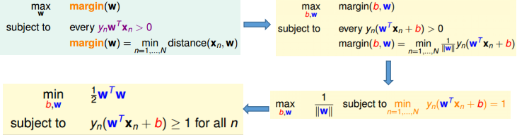
上面的最后一幅图结果就是SVM的基本框架

### 基于QP solver求解支撑向量机

SVM对应的表达式属于二次规划的问题，因此可以直接采用现成的求解方式求解：
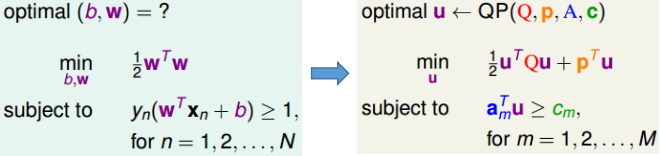
具体的算法流程如下所示：
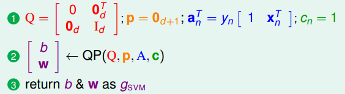

### SVM背后的依据

解释①：寻找最大边界超平面可以视为一种特殊情况的加入正则化过程
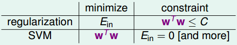
解释②：使得$d_{vc}$依赖于数据，从而有效降低了$d_{vc}$，因此可以避免overfitting
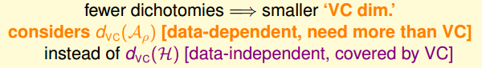

### 采用SVM的优势

由于SVM自带降低$d_{vc}$的“属性”，因此自带削弱“过拟合”的“光环”，将其和特征转换组合起来，既能获得非常复杂的分离超平面，又能避免过拟合。
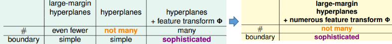

## 基于对偶形式的SVM

SVM结合特征转换后存在的一个问题，当转换后的特征数目过大时，通过QP solver解决起来就存在困难（变量数目大于条件数目），因此引入SVM的对偶形式来解决这个问题

### 拉格朗日函数的引入和求解

将原问题转换为对偶拉格朗日函数形式：
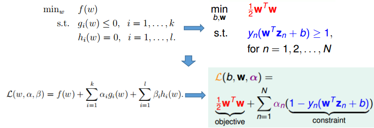
拉格朗日函数的简单解释：
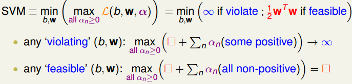
强对偶问题的“介入”：
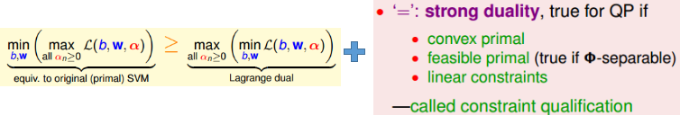
KKT条件：
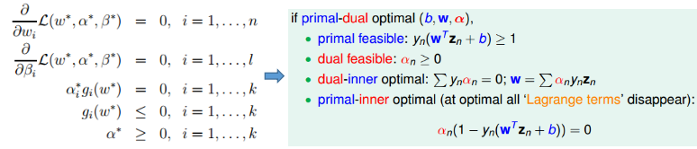
注：常规的求解方式为
①对Lagrange dual中的min项对应“下标参数”求导，代入$\mathcal{L}$进行一定的“约简” 
②结合原始条件+对偶问题中隐含的条件$\alpha^\star_ig_i(w^\star)=0$ 
③将全部结果代入$\mathcal{L}$，将结果化为只包含max项对应“下标参数”的情况

上述过程将常规SVM$\to$对偶形式的SVM：（其具体的对偶形式及求解如下）
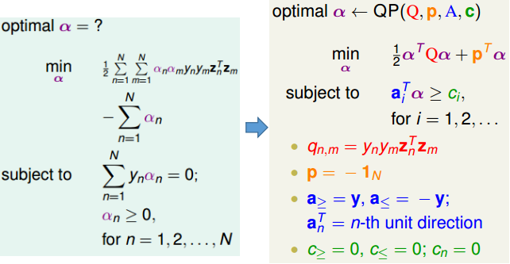
进一步求解最终的分离超平面：
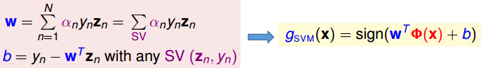

### 对偶SVM背后隐含的信息和存在的问题

对偶SVM与PLA的参数$w$的联系
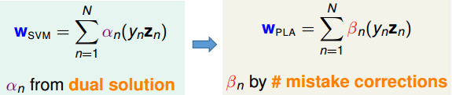
对偶SVM存在的问题：
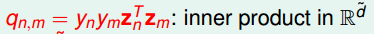

## 基于核函数的SVM

### 基于核函数的SVM算法

核函数本质上是将两个变量特征转换的乘积用两个变了乘积的形式来体现，从而有效减少计算复杂度。一个简单的对应关系实例如二次多项式核函数：
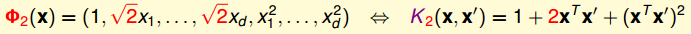
核函数的算法：

### 三种常见核函数的对比

① 线性核函数
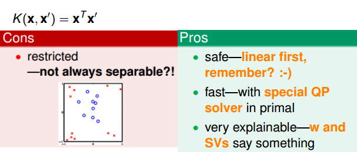
② 多项式核
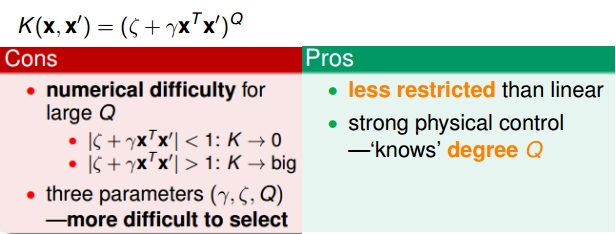
③ 高斯核
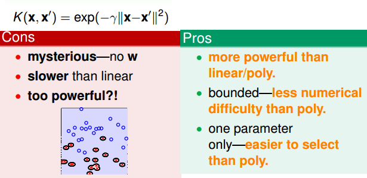

一个函数能否作为核函数的判别标准比较简单，满足Mercer's condition：
① 对称性
② 半正定性

具体通过已有核函数构造新的核函数的方法见作业1。

## 柔性边界SVM

### 加入惩罚项的柔性边界SVM

加入惩罚因子后的基本形式和其对应的拉格朗日函数：

利用强对偶情况的求解方式进行求解（与最大边界情况完全类似），可以获得其对偶形式如下：
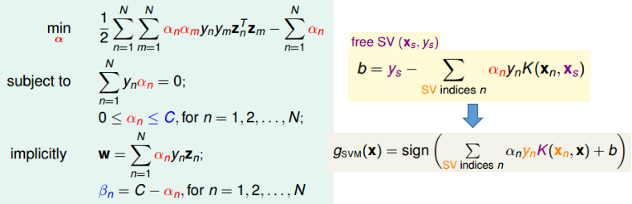
注：
①上述对偶形式与hard-margin形式的SVM除了$\alpha_n$的边界发生了变化，其他全部一样！
②上述情况中的free SV是指$0\lt\alpha_n\lt C$对应的数据项。
③ $\alpha_n=C$的情况代表“越界”的数据点（即被惩罚的数据）