机器学习技法Lec5-Lec8主要知识点：对应作业2
<!-- more -->

## 基于核函数的Logistic回归

### 柔性SVM与含正则项模型

根据柔性SVM的定义，可以获得其等价的无约束情况：
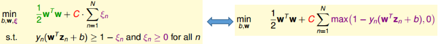
从无约束SVM的表达式可见，其非常“相似于”加入了$L_2$正则项的模型：
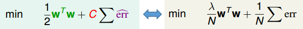
上述情况可见柔性SVM本质就是含有一个特殊$err$，以及利用另一个参数$C$替代$\lambda$以及选用更小的$w$的含正则项的模型。

**结合上篇文章中指出的，不管是柔性SVM还是hard-margin SVM均可以视为含正则项的模型**：
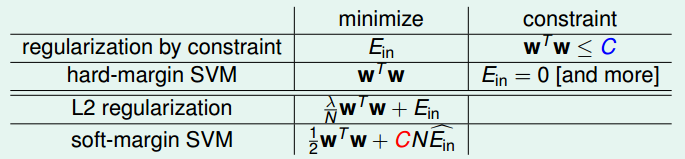
上述表格中包含一定的对应关系：
① 大的边界$\iff$更少可供选择的超平面$\iff$$L_2$正则化里将$w$限制的更小
② 柔性边界$\iff$特殊的损失函数$\hat{err}$
③ 大的“越界惩罚”$C$$\iff$更小的$\lambda\iff$“更弱”的正则化（其实就是更大的假设函数集）

将SVM看做含正则项的模型，这样更有助于理解和扩展

### 柔性SVM vs Logistic回归

柔性SVM的错误度量标准可以视为一种特殊的错误度量标准，将其与Logistic回归的错误度量标准进行比较：
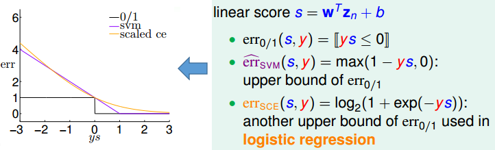
可以看出，当$ys\to-\infty or+\infty$时，$err_{SVM}\approx err_{SCE}$，所以$SVM\approx L2$正则化的Logistic回归

### SVM用于柔性二元分类

将SVM与Logistic回归结合起来，可以用于柔性二元分类（即以概率的形式给出结果），其具体的算法和优化目标如下所示：
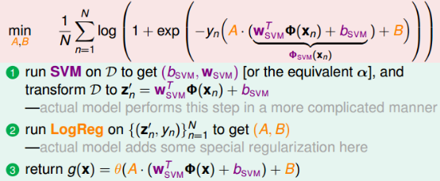
其中步骤①就是常规的SVM解法，步骤②可以采用梯度下降法来获得最优的$(A,B)$

### 表示理论（什么情况适用核函数）

首先给出表示理论的说明：
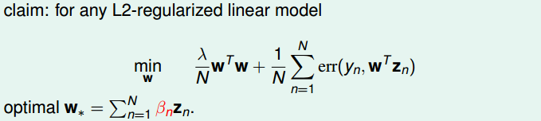
给出解释：
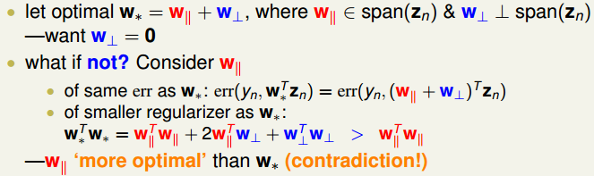
从而可见，对于任意$L_2$正则化的线性模型均可以采用核函数的方式！！！

### 基于核函数的logistic回归

将$w$最优解$w^\star=\sum_{n=1}^N\beta_nz_n$代入Logistic回归的目标函数，可以将其转换为核函数形式，且将求最优$w$的问题转变为求最优$\beta$的问题：
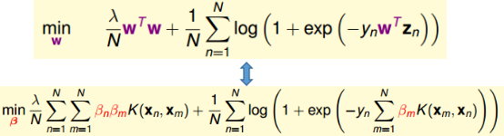
从上述可见，目标函数变得非常类似与SVM。但需要注意的是，该目标函数解得的$\beta$并不类似于SVM求得的$\alpha$具有很强的稀疏性。对于核函数的Logistic回归所求得的$\beta$大部分都是非零的。
可以如此理解，Logistic回归中是将所以数据均考虑进来，并没有支撑向量这个概念。不管转变与否，每个数据在Logtistic中至始至终都是被使用着。

## SVR(Support Vector Regression)

### 基于核函数的Ridge回归问题(LLSVM)

根据上面的内容可知，根据表示规则，Ridge回归问题可以转变为等价的含核函数问题：将$w^\star=\sum_{n=1}^N\beta_nz_n$代入原目标函数即可：

从而问题转变为求最优的$\beta$使得新的目标函数最小，对上式进行求导可得：
$$
\nabla E=\frac{2}{N}(\lambda K^TI\beta+K^TK\beta-K^TY)=\frac{2}{N}K^T((\lambda I+K)\beta-Y)\\
\nabla E=0\to\beta=(\lambda I+K)^{-1}Y
$$

从上式也不难发现，大部分$\beta$为非0，因此也为非稀疏的。

### Tube Regression

类似于“柔性”SVM，tube回归在原有线性回归模型中增加一定的“容忍度”，在距离小于一定范围内，认为没有误差，而大于该范围，则产生误差（从而使得$\beta$为稀疏的）。定义损失标准函数如下：
$$
err(y,s)=max(0,|s-y|-\epsilon)
$$
上述中容忍度为$\epsilon$。

从而带有$L_2$正则项的tube回归问题的目标函数为，以及为了更加与SVM形式对应，将$\lambda$替换为$C$：
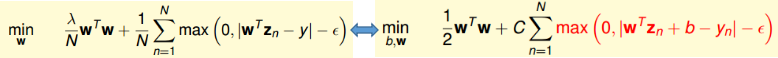

### Tube Regression$\to$SVR

类比于柔性SVM其含约束情况，可以将上述tube回归问题转化为含约束的情况：
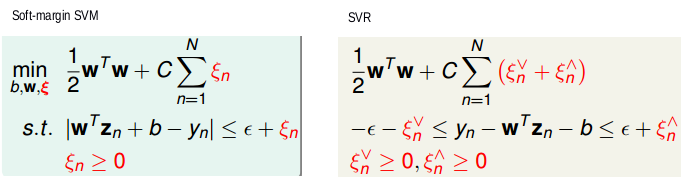
此时，后续的对偶化求解方式与SVM完全一样，可以自行推导，可以获得其等价的对偶形式，其中$\alpha^{\land}_n$是指$y_n-w^Tz_n-b\le\epsilon+\xi_n^{\land}$条件转化的拉格朗日乘子。$\alpha^{\lor}_n$是指$y_n-w^Tz_n-b\ge\epsilon+\xi_n^{\lor}$条件转化的拉格朗日乘子：
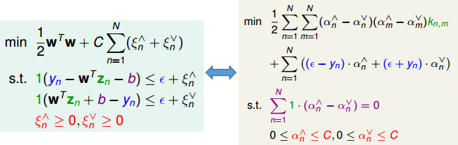
此外，上述的$\beta$是稀疏的，且稀疏项对应关系如下所示：
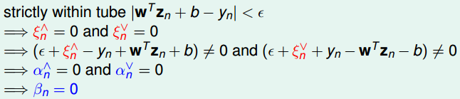

### 线性函数/核函数大集结

目前所有用到的线性模型以及其对应采用的核函数模型如下所示：
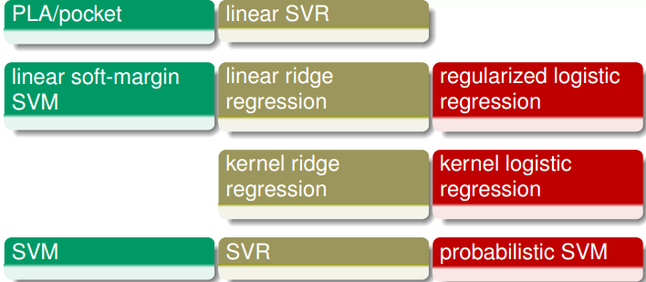
需要说明几点：
① 第四行在LIBSVM中非常受欢迎
② 第三行很少使用，因为其对应的$\beta$为非稀疏的
③ 第二行在LIBLINEAR中非常受欢迎
④ 第一行很少很少使用，因为一般表现比较差

## 模型融合和Bagging方法

### 模型融合

模型融合的几种常见类型：
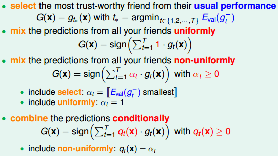
模型融合的意义：
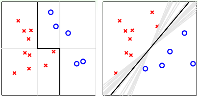
从上述两种融合情况来看：融合或许能起到① feature transform的作用  ② regularization的作用

### 基于均匀混合回归模型解释融合背后的思想

下述情况中需说明：① avg是指针对多个假设函数的平均  ② $E..or..\mathcal{E}$是指在不同数据集上的数学期望
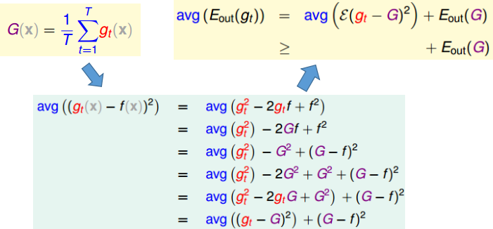
从上述结果不难看出：一系列假设函数$g_t$的误差平均要大于一系列假设函数平均的误差。

下面根据上述情况的一种特例来进一步说明混合模型的优势：
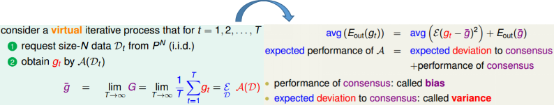
从上述特例可以很显著的看到均匀混合模型能够减少variance，从而提高模型的稳定性

### 混合模型$\iff$线性模型+特征转换

常见混合模型的目标函数：
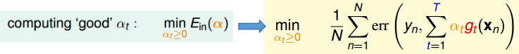
从上式不难发现：**线性混合模型=线性模型+特征转换(将假设函数视为特征转换)+约束条件**

比如线性融合的线性回归模型等价于线性回归+特征转换
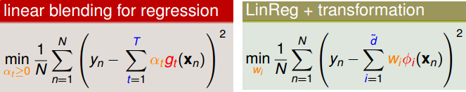
所以对于任意的混合模型可以写成其对应的特征转换模型：

其中$\Phi(x)=(g(x_1),g(x_2),...,g_T(x))$

### Bagging(Bootstrap Aggregation)

Bagging的定义：
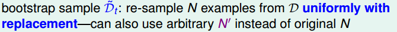
从理想的模型$\Longrightarrow$Bagging模型
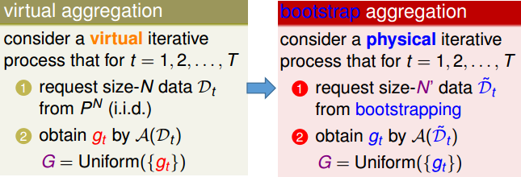

## Adaptive Boosting(AdaBoost)算法

### 调整权值来体现多样性

通过加入权值，可以起到类似于Bagging的作用：
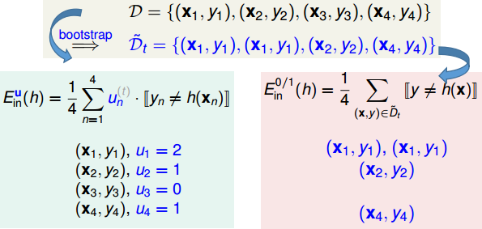
通过加入权值，可以间接增加假设函数集的多样性((获得不同的最优假设函数)：
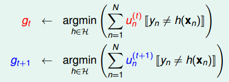

### AdaBoost算法

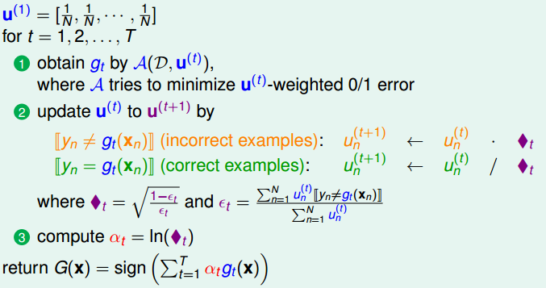
几点核心思想：1. “放大”上次分类错误的样本，“隐藏”上次分类正确的样本 2. 根据每种最佳函数的错误率来对每种权值情况下的最佳函数分配不同的权重 

上述算法的一些可供改变之处：为了避免出现$u^{(t)}\to0$的情况出现，可以在②的最后加上$u/sum(u)$将其始终保持和为1这个情况。

### AdaBoost背后的理论依据

可以根据VC bound理论给出下列结果：
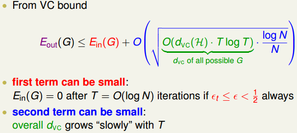
上述结果可以说明AdaBoost的可行性。