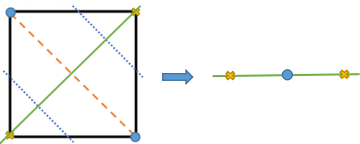
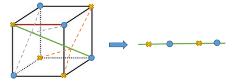

机器学习技法课后作业3-1：对应题目1～题目12
<!-- more -->

## 机器学习技法作业3

### 问题1

Q1~Q2：关于决策树的问题
“纯度函数”在决策树建立分支时(进行划分)时扮演重要作用。对于二分类问题，令$\mu_{+}$代表样本中正样本的比例。则$\mu_{-}$代表负样本的比例

Q1：根据Gini系数的定义，不难得到二分类问题的Gini系数为$1-\mu_{+}^2-\mu_{-}^2$。则当$\mu_{+}\in[0,1]$取何值时，Gini系数最大？

A1：相当于一个“优化问题”，二分类问题中，Gini系数可以表示为$\mu_{+}$的函数：
$$
1-\mu_{+}^2-\mu_{-}^2=1-\mu_{+}^2-(1-\mu_{+})^2=-2(\mu_{+}-0.5)^2+0.5
$$
从而当$\mu_{+}=0.5$时取到最大值$0.5$

Q2：存在下述四种“纯度函数”，为了能够建立比较，将他们除以各自的最大值归一化到$[0,1]$。经过归一化处理后，以下哪一种“纯度函数”与归一化了的Gini系数等价？
(a). classification error: $min(\mu_{+},\mu_{-})$
(b). the squared regression error: $\mu_{+}(1-(\mu_{+}-\mu_{-}))^2+\mu_{-}(-1-(\mu_{+}-\mu_{-}))^2$
(c). the closeness: $1-|\mu_{+}-\mu_{-}|$
(d). the entropy: $-\mu_{+}ln(\mu_{+})-\mu_{-}ln(\mu_{-}),with..0log0=0$

A2：首先可以知道Gini系数的归一化后的表达式为（为了方便，令$x=\mu_{+}$）：$4x-4x^2$
(a).  归一化后：$2min(x,1-x)$
(b).  原式=$x(2-2x)^2+(1-x)(2x)^2=4x(1-x)(1-x+x)=4x-4x^2$
(c).  原式=$1-|x-(1-x)|=1-|2x-1|$
(d).  原式=$-xlnx-(1-x)ln(1-x)$
显然不难知，(b)与归一化后的Gini系数相等

### 问题2

Q3~Q5：关于随机森林

Q3：如果从$N$个样本中bootstrapping出$N^\prime=pN$个数据出来，且假设$N$非常大，则估计有多少个样本没有被取到？

A3：一个样本没被取到的概率为$1-1/N$，从而对其中任意一个样本，$N^\prime$次未被取到的概率为：
$$
lim_{N\to\infty}(1-\frac{1}{N})^{pN}=(lim_{N\to\infty}(1-\frac{1}{N})^{N})^p=e^{-p}
$$
从而总的未被取到的样本为：$e^{-p}N$

Q4：假设随机森林的函数$G$由三个二元分类树$\{g_k\}_{k=1}^3$构成，且三个分类树的测试误差分别为$E_{out}(g_1)=0.1$,$E_{out}(g_2)=0.2$，$E_{out}(g_3)=0.3$。则$E_{out}(G)$的可能范围是多少？

A4：两个极限情况，可以根据下述两幅图说明（黄色---$g_1$错误的区域，橙色---$g_2$错误的区域，绿色---$g_3$错误的区域），且图二中绿色恰好被其他两色挡住。从而可以知道$0\le E_{out}(G)\le 0.3$

Q5：考虑一个含有$K$个二元分类树$\{g_k\}_{k=1}^K$的随机森林$G$，其中$K$为奇数，且每个分类树在测试集上的误差分别为$E_{out}(g_k)=e_k$，求$E_{out}(G)$的上界？

A5：假设整个测试集(全部数据集)离散化，一个点被随机森林最终错误的情况必须满足至少$(K+1)/2$个分类树都将其分错。从而一个错误点对应$\ge(K+1)/2$次错误。而总的错误次数为$\sum_{k=1}^Ke_k$，所以最极端情况下，存在$\frac{2}{K+1}\sum_{k=1}^Ke_k$个错误点。因此$E_{out}(G)\le\frac{2}{K+1}\sum_{k=1}^Ke_k$。当然也可以通过简单的实例来获得答案。

### 问题3

Q6~Q8：关于Gradient Boosting，需要注意的是，Q7和Q8涉及的是回归问题，而不是分类问题。

Q6：令$\epsilon_t$为AdaBoost算法中$g_t$关于加入权值情况下的$0/1$误差。且令$U_t=\sum_{n=1}^Nu_n^{(t)}$，则以下用$\epsilon_t$表示的哪条表达式等于$U_{T+1}$？

A6：根据Lec11第7页可知，且不妨假设$[y_n\ne g_t(x_n)]$有$n1$个，$[y_n= u_t(x_n)]$有$n2$个：
$$
U_{T+1}=\sum_{n=1}^Nu_n^{(T+1)}=\sum_{n=1}^Nu_n^{(T)}\sqrt{\frac{1-\epsilon_T}{\epsilon_T}}^{-y_ng_T(x_n)}=\sum_{n_1=1}^{n1}u_{n_1}^{(T)}\sqrt{\frac{1-\epsilon_T}{\epsilon_T}}^{1}+\sum_{n_2=1}^{n2}u_{n_2}^{(T)}\sqrt{\frac{1-\epsilon_T}{\epsilon_T}}^{-1}\\
=\sum_{n=1}^Nu_n^{(T)}\epsilon_T\sqrt{\frac{1-\epsilon_T}{\epsilon_T}}^{-1}+\sum_{n=1}^Nu_n^{(T)}(1-\epsilon_T)\sqrt{\frac{1-\epsilon_T}{\epsilon_T}}^{-1}=2\sqrt{(1-\epsilon_T)\epsilon_T}\sum_{n=1}^Nu_n^{(T)}\\
...=\prod_{t=1}^T2\sqrt{(1-\epsilon_t)\epsilon_t}
$$

上面的表达式中用到了一条(根据$\epsilon$定义而来的)：$\sum_{n_1=1}^{n1}u_{n_1}^{(T)}=\epsilon_TU_T$

Q7：对于gradient boosted决策树，如果树仅仅只有一个常数节点作为返回，且为$g_1(x)=2$。则经过第一次迭代之后，全部的$s_n$从$0$更新到一个新的数$\alpha_1g_1(x_n)$，求更新后的$s_n$？

A7：直接可知$g_1(x_n)=2$，之后便是求解$\alpha_1$，根据Lec11p17可知，最佳的$\alpha_1\to\eta$：
$$
min_\eta\frac{1}{N}\sum_{n=1}^N((y_n-s_n^{(0)})-\eta g_1(x_n))^2\to \nabla E=0\to \eta=\frac{1}{2N}\sum_{n=1}^Ny_n
$$
所以最终结果为$s_n^{(1)}=\sum_{n=1}^Ny_n$

Q8：对于gradient boosted决策树而言，利用下降最快的方向$\eta$作为$\alpha_t$经过$t$轮迭代后为$s_n^{(t)}$，求$\sum_{n=1}^Ns_n^{(t)}g_t(x_n)$为多少？

A8：根据Lec11p19可知，对于第$t$次迭代，最优的下降方向$\eta$为：
$$
\alpha_t=\eta=\frac{\sum_{n=1}^Ng_t(x_n)(y_n-s_n^{(t-1)})}{\sum_{n=1}^Ng_t^2(x_n)}\\\to \alpha_t\sum_{n=1}^Ng_t^2(x_n)+\sum_{n=1}^Ng_t(x_n)s_n^{(t-1)}=\sum_{n=1}^Ng_t(x_n)y_n
$$
根据$s_n$的更新规则可以获得下式：
$$
\sum_{n=1}^Ns_n^{(t)}g_t(x_n)=\sum_{n=1}^N(s_n^{(t-1)}+\alpha_tg_t(x_n))g_t(x_n)=\sum_{n=1}^Ng_t(x_n)y_n
$$

### 问题4

Q9~Q12：关于神经网络的问题

Q9：考虑一种特俗的神经网络，以$sign(s)$作为神经元(或称为转移函数)，即多层感知机模型，且我们认为$+1$代表True，$-1$代表False。假设下面式子中$x_i$为$+1$或$-1$，则下述哪个参数的感知机模型能够实现$OR(x_1,x_2,...x_d)$
$$
g_A(x)=sign(\sum_{i=0}^dw_ix_i)
$$
A9：$OR$即有对就对，全错才错的原则，可以直接给出答案，下述的参数情况满足要求：
$$
（w_0,w_1,w_2,...,w_d)=(d-1,-1,-1,...,-1)
$$
注：其中假设$sign(0)=+1$

Q10：根据Q9种同样的神经网络模型，则实现$XOR(x_1,x_2,x_3,x_4,x_5)$最小需要几个隐藏层神经元(采用的神经元模型为$(5-D-1)$)？

A10：首先理解$XOR(x_1,x_2,x_3)=XOR(XOR(x_1,x_2),x_3)$
方法1：基于$XOR$的性质不难知存在四种情况①+1遇-1$\to$不变②+1遇+1$\to$变-1③-1遇-1$\to$不变④-1遇+1$\to$变+1。从而可知，当$x_1,...,x_5$中存在奇数个$+1$时输出结果为+1，其他情况输出结果为-1。从而中间层包含5个神经元，分别含义为①存在5个+1 ②至少4个+1 ③至少3个+1 ④至少2个+1 ⑤至少一个+1。所构建的网络如下参数如下所示：
$$
w_{i1}^{(1)}=[-5,1,1,1,1,1]\quad w_{i2}^{(1)}=[-4,1,1,1,1,1]\quad w_{i3}^{(1)}=[-3,1,1,1,1,1]\\
w_{i2}^{(1)}=[-2,1,1,1,1,1]\quad w_{i3}^{(1)}=[-1,1,1,1,1,1] \\
w_{i1}^{(2)}=[-6,6,-6,6,-6,6]
$$
其中$w_{i1}^{(2)}$根据满秩所以必然有解。

方法2：在第一层转换中$s=w^Tx,not..include..w_0$，($w_0$留着当“阈值”)则相当于将其转换到与$x$相同维数的空间上的某条直线上去（过原点），则问题转换为寻找一条最佳过原点的直线，使得所需的“分割情况”最少。先以二维为例，总过结果情况有四种，则最佳直线为其对角线方向(四个点构成正方形)，如下图所示，则划分等价直线情况需要两个阈值，所以第二层神经元数目为2。

以及三维情况如下所示，则划分等价直线情况需要三个阈值，所以第二层神经元数目为3：

从而不难归纳出，对于$N$维情况，则划分其等价直线情况需要$N$个阈值，对应第二层神经元数目为$N$

Q11：对于包含至少一层隐藏层的神经网络，采用$tanh(s)$作为神经元(包含输入层)，且初始化$w_{ij}^{(l)}=0$，则下述关于梯度成分的描述正确的是？
(a). 只有参数$w_{j1}^{L},j\gt0$对应的梯度可能为非0，其他梯度必然为0
(b). 只有参数$w_{01}^{L}$对应的梯度可能为非0，其他梯度必然为0
(c). 全部的梯度均为0
(d). 只有参数$w_{0j}^{l},j\gt0$对应的梯度可能为非0，其他梯度必然为0

A11：根据神经网络中梯度部分的求解方式Lec12p14可知：
$$
\frac{\partial E}{\partial w_{ij}^{(l)}}=\delta_j^{(l)}(x_i^{(l-1)})\\
\delta_1^{(L)}=-2(y_n-s_1^{(L)})\\
\delta_j^{(l)}=\sum_k(\delta_k^{(l+1)})(w_{jk}^{l+1})(tanh^\prime(s_j^{(l)}))
$$
根据前向传播的规则可知，$x_i^{(l)}=0,l\ge1$，从而不难发现$\delta_j^{(l)}=0,l\lt L$，$\delta_1^{(L)}\ne0, if..y_n\ne0$，$x_i^{(L-1)}=0,i\ne 0..and..x_0^{(L-1)}=1$。根据这些条件可以知道，唯一可能非零项为$w_{01}^{(L)}$对应的梯度部分

Q12：对于包含一层隐藏层的神经网络，采用$tanh(s)$作为神经元(包含输入层)，且初始化$w_{ij}^{(l)}=1$，则下述关于反向传播算法的描述正确的是？
(a). $w_{ij}^{(l)}$对应的梯度部分为0
(b). $w_{ij}^{(1)}=w_{(i+1)j}^{1},for..1\le i\le d^{(0)}-1..and..all..j$
(c). $w_{ij}^{(1)}=w_{i(j+1)}^{1},for..1\le j\le d^{(1)}-1..and..all..i$
(d). 全部$w_{j1}^{(2)},j\gt0$均不同

A12：显然通过Q11中的解答可以直接看出，$\delta_{j}^{(l)}$对于不同的$j$相等，从而可知(c)项正确。(b)项错误是因为输入的$x$每一维度未必相等。