机器学习技法Lec9-Lec12主要知识点：对应作业3
<!-- more -->

## 决策树

### 三种不同类型的集成模型

常见的三种基本集成模型如下表所示（其中①blending代表融合的方式---可以理解为在获得$g_t$后采用的融合策略 ②learning代表具体的学习算法---可以理解为在学习的过程中就将融合的策略加入$g_t$）
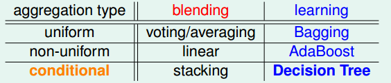
后续大部分集成算法都是基于这些集成算法进一步“融合或改进”

### 决策树模型基本框架

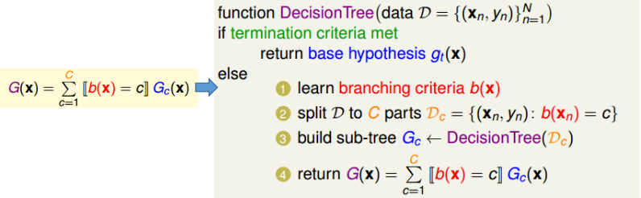

### CART算法（决策树模型的一种）

“纯度函数”(impurity()函数)的选择：推荐回归问题中采用regression error，分类问题中选用Gini index
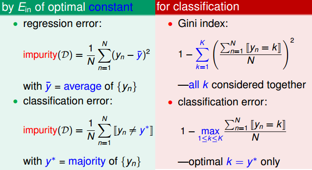
终止条件的选择：

CART算法的实现：
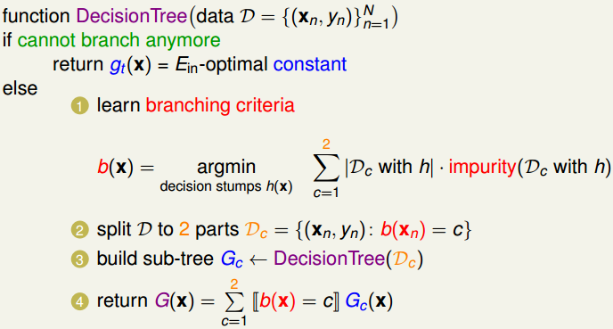

### CART存在的问题及改进

① 过拟合问题：完全生长的树容易导致过拟合（$E_{in}=0$）
加入正则项，该正则项可以为限制**叶子结点**的数目，从而使树“生长”到一定程度就停止了

② 特征缺失问题：比如需预测的数据中某个特征$x_i$缺失
在进行划分的过程中，如果遇到最优划分特征为“$x_i$”，则采用“次优或其他”的特征(且该数据包含的特征)来替代该特征的划分。但是这样付出的代价就是要“保留”其他特征“拿来替换”特征的划分标准等

CART树的优点：
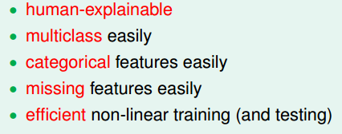

## 随机森林

### 随机森林算法框架

随机森林=bagging+fully-grown CART：结合了bagging降低variance的特点以及CART具有较大variance的特点。
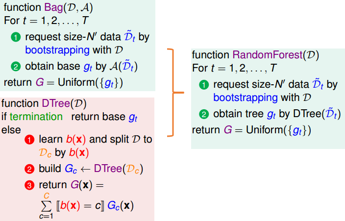
增加随机森林“多样性”的方法（增加了决策树的多样性）--- 这也是随机森林“随机”的体现：
① 通过“bagging”使得每次数据集不一样，从而使得每次决策树基于的样本不同。增加了决策树的多样性
② 每次$b(x)$过程中选用$d^\prime$个特征，而不是$d$个特征（$d^\prime \ll d$），从而能够获得更多不同的决策树 

### 随机森林的小技巧

① 随机森林的自验证（OOBvalidation）
通过bagging每次会有一部分数据并未被取到，而该部分可以被用作验证集
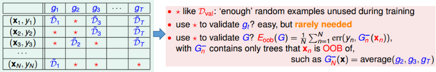
需要主要的是，其中$G_n^{-}(x_n)$代表全部在bagging中未取到$x_n$的决策树的平均，而不是全部决策树的平均

② 特征选择技巧
可以采用的策略有

- 移除冗余特征(如年龄和生日)和不相关特征

- 给不同特征赋予不同的重要性，在随机森林中可以通过下述策略来衡量特征重要性（替换后错误率改变多少来衡量）：
  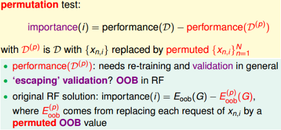

③ 随机森林可能存在的问题
当全部的“随机过程”显得非常“随机”时，会带来不稳定性，从而可能需要非常多的决策树融合才能达到较好的效果

## GBDT（Gradient Boosted Decision Tree）

### AdaBoost-DTree

类似随机森林的方法，运用到AdaBoost-DTree上，有下述结果：
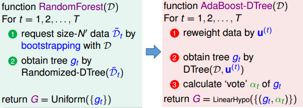
上述“直接延伸”存在的问题：
① 破坏了DTree，需要重新构造新的决策树算法
解决方法：将权值通过“bagging”来体现，即bagging取样时，并不是直接采用等概率随机方法，而是根据$samling\propto u^{(t)}$来取样，从而也能起到$E_{in}^{u}(h)=\frac{1}{N}\sum u_n\cdot err(y_n,h(x_n))$的效果
② 完全生长树存在误差为0的问题：

解决方法：通过对树进行剪枝，比如限制树的高度，限制叶子结点的数目等等。

### 以优化的观点来看AdaBoost

AdaBoost更新$u_n^{(t+1)}$时采用下述的策略：
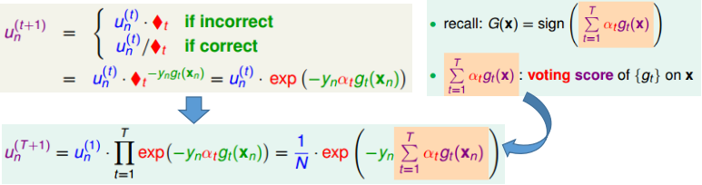

令$s_n=\sum_{t=1}^T\alpha_tg_t(x_n)$，站在SVM的角度可见，当$y_ns_n$越大，代表离分离超平面越远，如果全部的数据均能使得其随着$T$增大，$y_ns_n$增大，则说明这个超平面“越来越好，鲁棒性更强”：
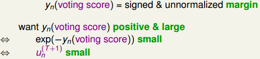
因此，AdaBoost问题的每次更新可以理解为不断减少$\sum_{n=1}^N u_n^{(t)}$，因此可以视为下述优化问题：
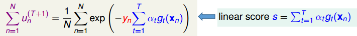
为了与常见的损失函数联系起来，建立下述对应关系：
$$
E(w_t)=\frac{1}{N}\sum_{n=1}^N exp(-y_nw_t)\quad w_t=\sum_{k=1}^{t-1}\alpha_kg_k(x_n)\\
等价于err=exp(-ys)的损失函数
$$
从而通过“一阶泰勒展开”来推导梯度下降法：
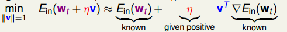
从而可以推导出下式（理清$w_t$具体表示的是什么），其中$v=h(x)$：
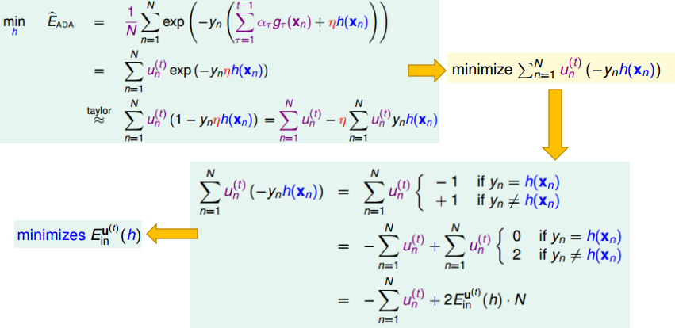
上式推导可见，通过梯度下降法寻找的最优$h=v$等价于通过AdaBoost算法寻找$E_{in}^{u(t)}(h)$最佳的$h$。因此可见，AdaBoost算法背后的原理也就是通过梯度下降法寻找最优的$h$

当求解得最佳的$g=h$，下一步就是求解$\eta$：
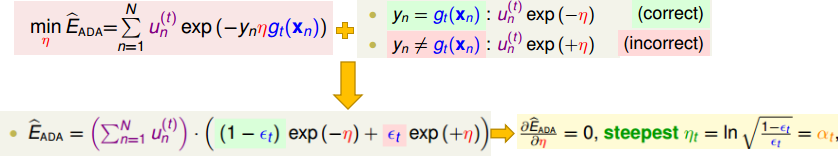
求解结果也等价于AdaBoost中采用的$\alpha_t$。

从而可见，AdaBoost可以视为GradientBoost的一种情况，且GradientBoost具有更好的“可拓展性”，可以更改误差衡量函数$err$便可获得不同的GradientBoost算法：
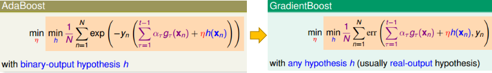

GradientBoost算法通常的解法：
① 先将$\eta$视为常量，求最佳的$h=g$
② 将最佳的$g$代入，求最佳的$\eta$

### 基于平方损失的GradientBoost

对应的GradientBoost基本形式：
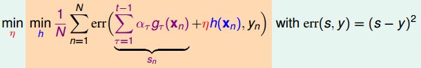

步骤①： 寻找最佳$h$：
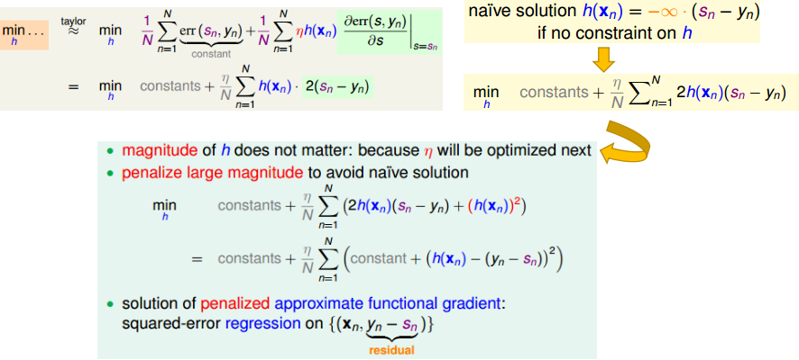
步骤②： 寻找最佳$\eta$：
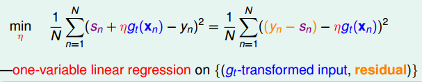
步骤③： 结合全部的情况，并结合决策树，获得最终的GBDT算法
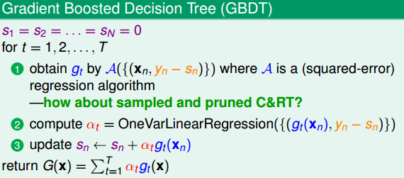

### 集成模型大纲

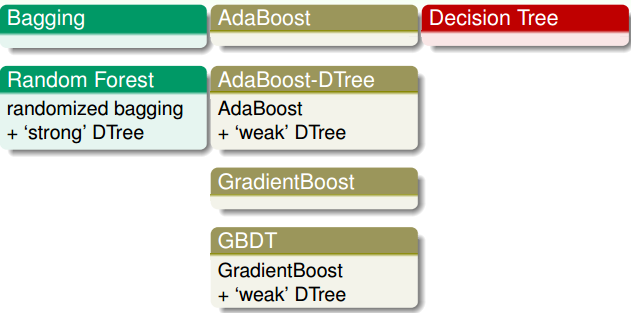
上述的模型均比较常用，视具体应用场景而定

## 神经网络

### 神经网络基本框架

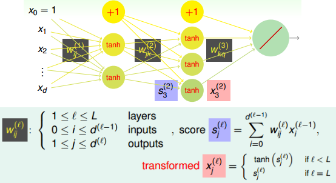
对应的损失函数：
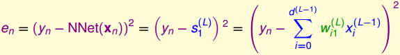

### 反向传播算法

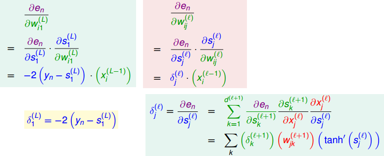
对应的具体算法流程
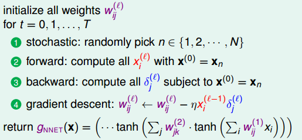

### 对应的VC维和正则化

粗略估计对应的VC维：
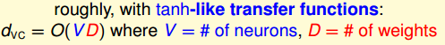
容易导致过拟合，可以采用的策略：
① 加入正则项，例如L2正则项：$\sum(w_{ij}^{(l)})^2$
② 提前停止，梯度下降到一定程度就停止