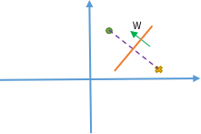
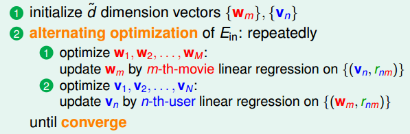

机器学习技法课后作业4-1：对应题目1～题目10
<!-- more -->

## 机器学习技法作业4

### 问题1

Q1~Q3：关于神经网络和深度学习

Q1：考虑一个完全连接的网络，包含三层，每层的神经元数目为$d^{(0)}=5,d^{(1)}=3,d^{(2)}=1$。如果仅仅认为以下三种形式的乘积$w_{ij}^{(l)}x_i^{(l-1)},w_{ij}^{(l+1)}\delta_j^{(l+1)},x_i^{(l-1)}\delta_j^{(l)}$算作一次运算（当然此处的$x$也包括$x_0=1$）。则进行一轮随机梯度下降法更新参数，需要进行多少次运算？

A1：分为前向传播和反向传播：
前向传播：只涉及到$w_{ij}^{(l)}x_i^{(l-1)}$运算，总共进行了$n_1=(5+1)\times 3+(3+1)\times1=22$
反向传播：前面几层求$\delta_j^{(l)}$时涉及到$w_{ij}^{(l+1)}\delta_j^{(l+1)}$运算，且每一层对应该运算的次数为$l+1$层神经元数目。而每一个参数均需经历一次$x_i^{(l-1)}\delta_j^{(l)}$的运算，所以总的数目为$n_2=22+3\times 1=25$
所以，总的运算次数$n=n_1+n_2=47$

Q2~Q3：考虑一个没有“误差项”$x_0^{(l)}$的神经网络。且假设输入层元素为$d^{(0)}=10$，隐藏层包含36个神经元(但隐藏层有多少层不一定)，输出层包含一个神经元，且神经网络为全连接网络，求所有可能的网络中，参数$w$数目最少和最多分别为多少？

A2~A3：寻找所有可能的组合情况，可以参考[数字之和问题](http://stackoverflow.com/questions/4632322/finding-all-possible-combinations-of-numbers-to-reach-a-given-sum)，具体的实现代码如下：

```python
# q2-q3
hidden = []
def subset_sum(numbers, target, partial=[]):
    s = sum(partial)
    # check if the partial sum is equals to target
    if s == target:
        # print("sum(%s)=%s" % (partial, target))
        hidden.append(partial)
    if s >= target:
        return  # if we reach the number why bother to continue

    for i in range(len(numbers)):
        n = numbers[i]
        remaining = numbers[i:]
        subset_sum(remaining, target, partial + [n])
```


```python
subset_sum([i+1 for i in range(36)], 36)
maxi = 0; mini = 1000
for i in range(len(hidden)):
    wnum = 0
    hidden[i].append(1)
    for j in range(len(hidden[i])-1):
        wnum += hidden[i][j]*hidden[i][j+1]
    wnum += 10*hidden[i][0]
    maxi = wnum if wnum>maxi else maxi
    mini = wnum if wnum<mini else mini
print('最多情况: ', maxi, '\n最少情况: ', mini)
```

    最多情况:  522
    最少情况:  46
### 问题2

Q4~Q5：自动编码问题

假设自动编码的“编码层”$\hat{d}=1$，则对应的参数矩阵$W$就为$d\times1$，线性编码的目标函数为：
$$
E_{in}(w)=\frac{1}{N}\sum_{n=1}^N||x_n-ww^Tx_n||^2
$$
我们可以通过随机梯度下降法$err_n(w)=||x_n-ww^Tx_n||^2$求解来求解

Q4：$\nabla_werr_n(w)$的表达式为什么？

A4：$err=x_n^Tx_n-2x_n^Tww^Tx_n+(ww^Tx_n)^T(ww^Tx_n)$，其中只有后两项与求导相关。分别对这两项求导：
第一项：令$a=w^Tx_n$，从而有
$$
\nabla P1=\frac{\partial P1}{\partial a}\cdot\frac{\partial a}{\partial w}=-4a\cdot x_n=-4w^Tx_nx_n
$$
第二项：令$a=w^Tx_n=x_n^Tw,b=w^Tw$，从而$P2=aba$有：
$$
\nabla P2=\frac{\partial a}{\partial w}ba+(\frac{\partial b}{\partial w}a+\frac{\partial a}{\partial w}b)a\\
=x_n(w^Tww^Tx_n)+2w(w^Tx_n)w^Tx_n+x_nw^Tww^Tx_n\\
=2(x_n^Tw)^2w+2(x_n^Tw)(w^Tw)x_n
$$
上述运算要时刻看清哪些可以视为标量，所以结合第一项和第二项不难知：
$$
\nabla err=2(x_n^Tw)^2w+2(x_n^Tw)(w^Tw)x_n-4w^Tx_nx_n
$$
Q5：假设输入是含有噪声的$\hat{x}=x_n+\epsilon_n$，且$\epsilon_n\sim \mathcal{N}(0,1),i.i.d$。从而优化目标就转变为了：
$$
E_{in}(w)=\frac{1}{N}\sum_{n=1}^N||x_n-ww^T(x_n+\epsilon_n)||^2
$$
对于任意固定的$w$，求$\mathcal{E}(E_{in}(w))$

A5：$E_{in}$可以拆分为：
$$
E{in}=\frac{1}{N}\sum{n=1}^N||x_n-ww^Tx_n||^2-2\sum_{n=1}^N((I-ww^T)x_n)^T(ww^T\epsilon_n)+\sum_{n=1}^{N}(ww^T\epsilon_n)^T(ww^T\epsilon_n)
$$
从而问题就转换为求$\mathcal{E}(-2\sum_{n=1}^N((I-ww^T)x_n)^T(ww^T\epsilon_n)+(ww^T\epsilon_n)^T(ww^T\epsilon_n))$，由于第一项中只涉及到$\epsilon$的一次项，且其均值为0，所以该项为0。主要针对第二项，令$A=ww^T\epsilon_n$：
$$
\mathcal{E}(\sum_{n=1}^{N}(ww^T\epsilon_n)^T(ww^T\epsilon_n))=\sum_{n=1}^{N}\mathcal{E}(A^TA)=\sum_{n=1}^{N}[(\mathcal{E}(A))^2+D(A)]=\sum_{n=1}^{N}D(A)
$$
根据[variance相加法则](http://stats.stackexchange.com/questions/31177/does-the-variance-of-a-sum-equal-the-sum-of-the-variances)可知，上式等价于：
$$
\sum_{n=1}^{N}D(A)=\sum_{n=1}^{N}cov(ww^T\epsilon_n, ww^T\epsilon_n)=(w^Tw)^2
$$

### 问题3

Q6~Q8：最近邻问题和RBF网络

Q6：考虑基于两个样本$(x_1,+1),(x_2,-1)$的“1 Nearest Neighbor”假设函数，则与其等价的线性假设函数$g_{LIN}(x)=sign(w^Tx+b)$形式为什么？

A6：$w^Tx+b=0$相当于分离超平面，从而可知$w=k(x_1-x_2)$如下图所示(以二维情况为例子)：

从而可知，该超平面过点$((x_1+x_2)/2,0)$，结合这两个条件可以联立的：
$$
k(x_1-x_2)\frac{x_1+x_2}{2}+b=0\to b=\frac{k}{2}(||x_2||^2-||x_1||^2)\\
k(x_1-x_2)x_1+\frac{k}{2}(||x_2||^2-||x_1||^2)\gt0\to k\gt0
$$
所以可以选择$k=2$

Q7：考虑基于RBF网络的二元分类问题：
$$
g_{RBFNET}(x)=sign(\beta_+exp(-||x-\mu_+||^2)+\beta_-exp(-||x-\mu_-||^2))
$$
且假设$\beta_+\gt0\gt\beta_-$，则与之等价的$g_{LIN}(x)=sign(w^Tx+b)$形式是什么？

A7：以+的情况来考虑
$$
\beta_+exp(-||x-\mu_+||^2)\gt-\beta_-exp(-||x-\mu_-||^2)\to -||x-\mu_+||^2+ln\beta_+\gt -||x-\mu_-||^2+ ln(-\beta_-)\\
\to ln\frac{\beta_+}{-\beta_-}+||x-\mu_-||^2-||x-\mu_+||^2\gt0\to 2(\mu_+-\mu_-)x+ln|\frac{\beta_+}{\beta_-}|+||\mu_-^2||^2-||\mu_+||^2\gt0
$$
从而可以获得$w=2(\mu_+-\mu_-), b=ln|\frac{\beta_+}{\beta_-}|+||\mu_-^2||^2-||\mu_+||^2$

Q8：假设一个全连接的RBF网络采用$RBF(x,\mu)=[[x=\mu]]$，以及在数据集上采用平方损失函数(输入数据均不相同)，则对于每个$RBF(x,x_n)$其最优的$\beta_n$为多少？

A8：根据上述定义，不难知$z_n=[RBF(x_n,x_1),...,RBF(x_n,x_N)]=[0,0,..,0,1,0,...,0]$，从而$Z=I$。根据平方损失$min(Z\beta-Y)^2\to\beta=Z^{-1}Y=Y$

### 问题4

Q9~Q10：矩阵因子分解(Matrix Factorization)

Q9：考虑“单个中间层”$\hat{d}=1$的矩阵因子分解情况，假设用户因子矩阵$V: \hat{d}\times N$初始化为1，则根据Lec15中给出的更新规则2.1，更新时最佳的$w_m$(第m部电影的电影因子向量: $\hat{d}\times 1$)为多少？


A9：损失函数：$\sum_{m=1}^M\sum_{(x_n,r_{nm})\in D_m}(r_{nm}-w_m^Tv_n)^2$,从而对$w_m$求导可得：
$$
2\sum_{(x_n,r_{nm})\in D_m}(r_{nm}-w_m^Tv_n)v_n=0\to w_m=\frac{\sum_n r_{nm}}{\sum_n 1}
$$
从而不难知，最佳的$w_m$为第$m$部电影的平均得分

Q10：假设分数矩阵为$R: N\times M$，且我们已经获得了一个矩阵因子分解$R=V^TW$，即$r_{nm}=v_n^Tw_m$。此时，有一个新的用户$(N+1)$来了，由于我们完全没有该用户的信息，因此不知道她喜欢哪种类型的电影，所以初始化用户因子矩阵为$v_{N+1}=\frac{1}{N}\sum v_n$，因此我们的推荐系统将根据$v_{N+1}^Tw_m$中最大的电影推荐给她，则这部电影的特点为？

A10：$v_{N+1}^Tw_m=\frac{1}{N}\sum_{n=1}^N v_n^Tw_m=\frac{1}{N}\sum_{n=1}^N r_{nm}$，等价于每部电影用户的平均评分，所以推荐的电影为用户平均评分最高的