机器学习技法Lec13-Lec16主要知识点：对应作业4
<!-- more -->

## 深度学习

### 深度学习基本步骤

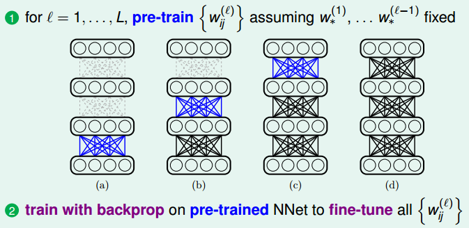
采用pre-training的权值主要是为了：①加快后续的训练过程  ②减少调入局部最小值的情况

### 深度学习面临的挑战和技巧

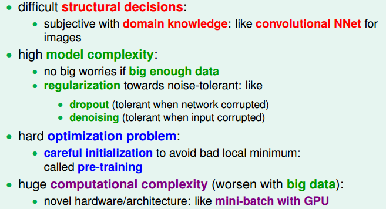
这部分的内容等后续等深度学习进一步了解后再写

### 自动编码机（用途广泛，可作为pre-training的方法）

自动编码机的本质：将输入信息以“另一种形式(一般占空间更少)”保留，这种形式的信息很容易能够“复原”回原本信息，且只丢失很少的信息。

① 基础自动编码机的形式：
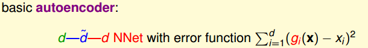
其中$d\to \hat{d}$：称为编码（$\hat{d}\lt d$：有降维的作用），$\hat{d}\to d$：称为解码

② 自动编码机的特点
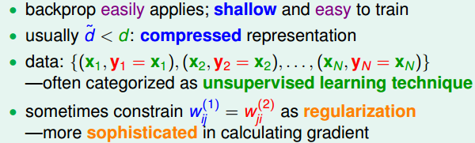
比较常见的自动编码机采用的$w$满足上述的条件

③ 自动编码机的用途
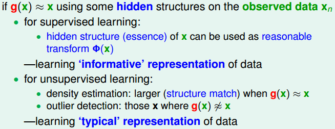

④ 抗噪型自动编码机
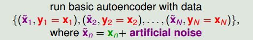

### 线性自动编码机

① 线性自动编码机的形式：
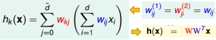

② 线性自动编码机的目标函数(损失函数)
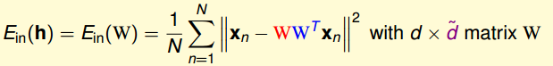
由于$WW^T$为[正规矩阵](https://www.wikiwand.com/zh-cn/%E6%AD%A3%E8%A7%84%E7%9F%A9%E9%98%B5)，因此可以分解为$WW^T=V\Gamma V^T$（其中$\Gamma$为对角矩阵(且只有前$\hat{d}$个元素为非零)，$V$为[酉矩阵](https://www.wikiwand.com/zh-cn/%E9%85%89%E7%9F%A9%E9%98%B5),实数情况为正交矩阵）。因此$WW^Tx_n=V\Gamma V^Tx_n$

- 其中$V^Tx_n$：因为$V^T$可以视为一个[旋转矩阵](https://www.wikiwand.com/zh-cn/%E6%97%8B%E8%BD%AC%E7%9F%A9%E9%98%B5)将$x_n$进行旋转或投影变化，而不改变$x_n$的长度，如下图所示的二维情况
  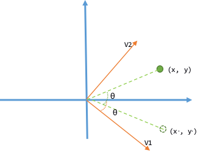
- $\Gamma (V^Tx_n)$：将$V^Tx_n$后面$d-\hat{d}$个元素置0，同时对前面$\hat{d}$个元素进行缩放
- $V(\Gamma V^Tx_n)$：将缩放后的值重新旋转回原坐标系下

③ 目标函数变为下述形式：
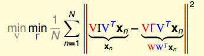

1. 考虑最优的$\Gamma$：
   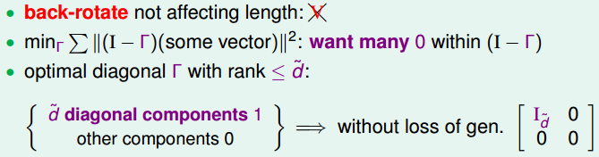
2. 考虑最优的$V$：
   将最优$\Gamma$代入后可得优化目标函数
   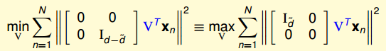
   从而有
   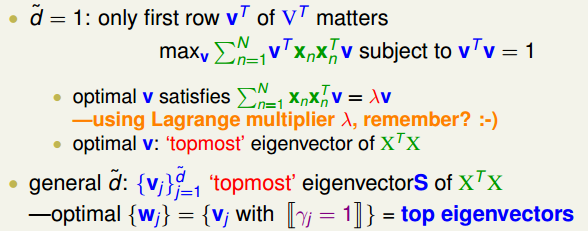

③ 线性自动编码$\to$PCA
PCA基本形式
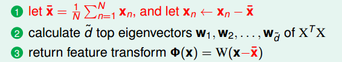
线性自动编码和PCA背后的思想：
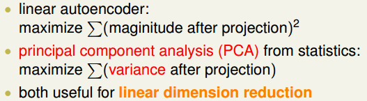

## RBF网络(Radial Basis Function Network)

### RBF网络基本框架

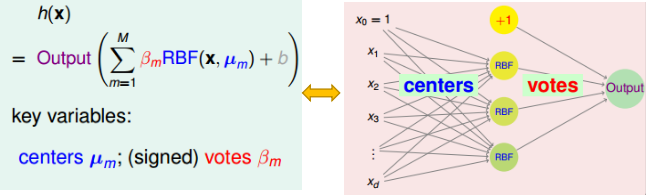
① $b$通常都是不放在这的
② 其中RBF为高斯函数，常用的形式为$exp(-\gamma ||x-x_n||^2)$
③ RBF网络背后的思想：RBF函数可以视为度量$x$与每个“理想中心点”的相似度，而下一层则对于不同的“理想中心点”的“重要性”不同。（而至于这些“理想中心点”如何而来方法多样，也可以结合先验知识。）

### 全连接的RBF网络

全连接的RBF网络可以视为将全部的训练集的数据均视为中心点：
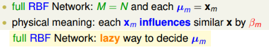
这种网络的方便之处就是无需自己确定中心点：$\mu_m$，但同样带了了存储空间的问题和预测效率的问题。

### 全连接RBF网络$\to$k近邻算法

将$\beta_m=y_m$且作为分类问题时，就可以得出最近邻算法：
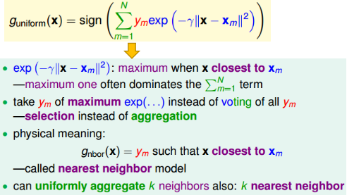

### 全连接网络+平方损失

全连接网络可以用于回归问题，其假设函数集形式如下：
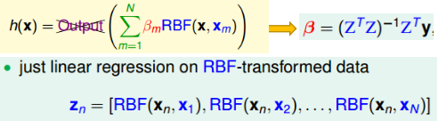
上述的目标函数为：$E=\sum_{n=1}^N(\beta^TZ_n-y_n)^2$，从而求导有上述最优的$\beta$

当$N$个数据均不同时，其对应的$Z$矩阵可逆(对称矩阵)，从而有最优$\beta=Z^{-1}y$

全连接网络的最优解将使得$E_{in}=0$，容易过拟合，因此需要加入正则项：
① ridge regression：$\beta=(Z^TZ+\lambda I)^{-1}Z^TY$，即在目标函数后面加上$\lambda \beta^T\beta$惩罚项
② 限制中心点和$\beta$的数目：可以联想SVM，只有一些SVs真正起作用

### k-Means算法

① 核心思想：将“相近(或相似)”的点归为一类
② 目标函数：$[x_n\in S_m]=1$当$x_n$归为第$m$类，否则为0：
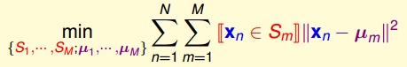
③ 具体算法：
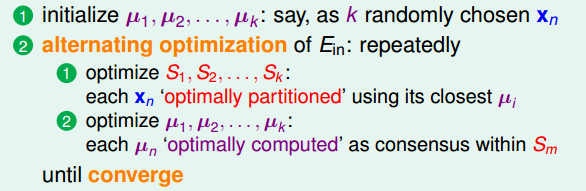

### RBF网络+k-Means

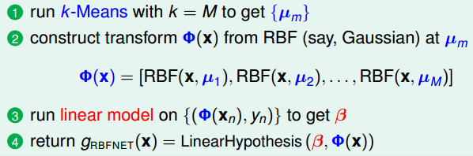

## 矩阵因子分解

### 线性网络（以推荐系统为例）

① 符号含义： $x_i=[0,0,...,1,0,...,0]^T$第$i$个用户，$y_n=[r_{n1},r_{n2},...,r_{nm}]$：第$n$个用户对$m$部电影的评分
② 线性网络：
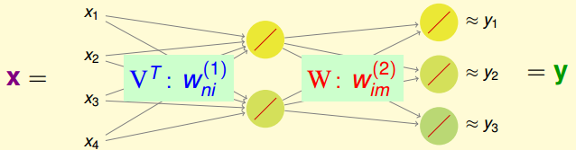
从而假设函数为：$h(x)=W^TVx$
对于第$n$个用户：$h(x_n)=W^TVx_n=W^Tv_n$($v_n$代表$V$的第$n$列)
线性网络背后的思想：第一层$V$可以视为特征转换$\phi(x)$，第二层$W$可以视为线性组合
假设函数对于第$m$部电影为$h_m(x)=w_m^T\phi(x)$($w_m$: 代表第$m$列)，从而可知$r_{nm}=w_m^Tv_n$
③ 目标函数：
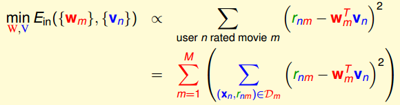
④ 算法实现：

⑤ 矩阵因子分解的意义： 隐藏了用户/电影 的特征，无需人为构造这些特征

### 基于随机梯度下降法的矩阵因子分解

线性网络对应的目标函数及其单个数据对应的误差衡量函数：

因此我们可以采用随机梯度下降法来求解$V,W$矩阵，具体算法如下所示：
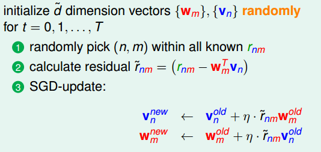
采用梯度下降法的优势：实现简单高效，同时更易于扩展(比如不同的$err$函数)

### 特征提取模型(Extraction Models)

特征提取模型：特征转换$\Phi$以隐藏层的变量来表示+线性组合模型

常见的模型：
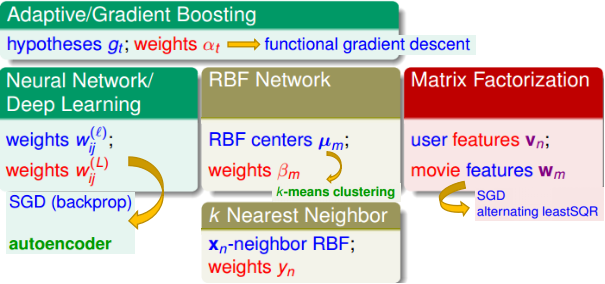
特征提取模型的优缺点：
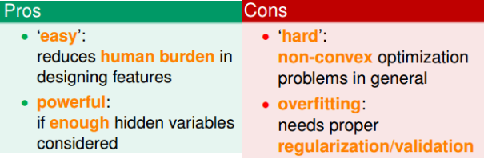

## 总结篇

### 利用特征的技术

① 利用Kernel技巧利用大量的特征
使用kernel技巧将大量特征通过内积形式来体现。
常见kernel类型：
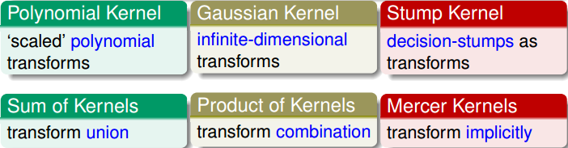
常见利用kernel的算法：
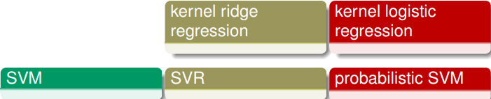

② 利用Aggregation技术利用预测特征(将预测结果作为特征)
将预测结果$g_t(x)$作为特征转换：$\phi_t(x)=g_t(x)$
常见作为$g_t(x)$的模型：
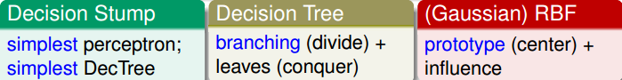
常见集成算法：
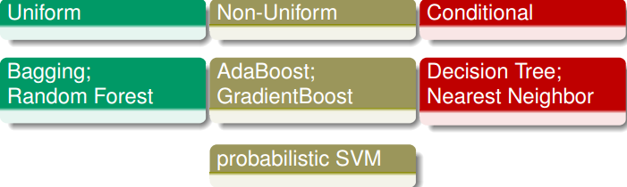

③ 通过特征提取来“创造”潜在特征
将潜在的特征转换$\phi$通过中间层变量来表示
常见“利用潜在特征”的特征提取算法：
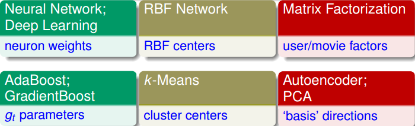

④ 通过压缩来使用低维度特征
将原始特征压缩为更低维度的特征
常见的提取低维特征方法：
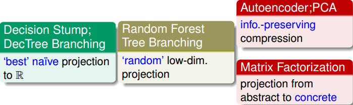

### 优化方法

① 基于梯度下降法的优化方法
采用1阶泰勒展开来更新参数：$new..variables=old..variables-\eta\nabla E$
常见的方法：
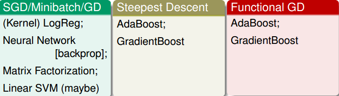

② 基于与优化目标函数等价形式的优化
可以采用与目标函数等价的函数形式(例如加入了约束条件等)
常见方法：
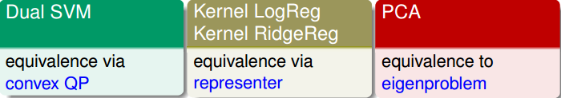

③ 通过不断迭代来处理复杂优化问题
可以通过解决相对简单的“子问题”来不断进行从而解决复杂问题
常见方法：

### 过拟合的解决方法

① 通过正则项来减少过拟合
常见的正则化方法：
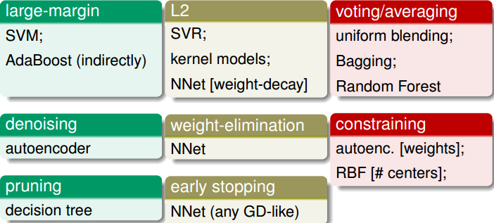
② 通过交叉验证(validation)来减少过拟合
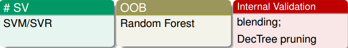

